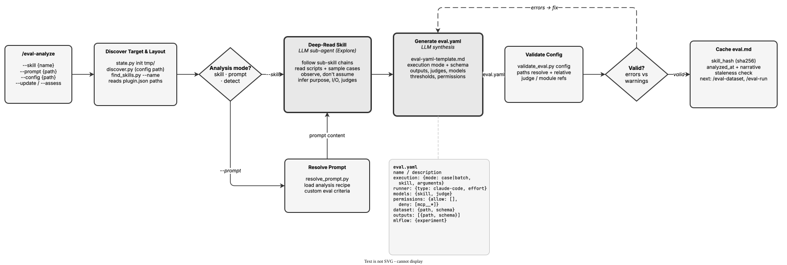

<!-- Auto-generated from registry.yaml. Do not edit directly. -->


# eval-analyze

Deep-reads a target skill and generates eval.yaml -- the configuration that
/eval-run needs. Examines the skill's SKILL.md, follows sub-skill chains
recursively (typically 2-5 levels, capped at 5 to avoid circular references)
until it finds the skills that produce the final artifacts, explores scripts
and test cases, and produces a complete config with execution mode, dataset
schema, output descriptions, judges, model defaults, and thresholds. Uses an
Explore sub-agent for the recursive skill analysis, validates the result with
validate_eval.py, and caches the analysis in eval.md with a content hash of
the top-level SKILL.md for staleness detection. The guiding principle is
"observe, don't assume" -- every field name and path must come from a file
actually read. Auto-invoked by /eval-run when eval.yaml is missing.

**Plugin**: [agent-eval-harness](index.md) | **:material-check: User-invocable**

## Contract

<div class="skill-contract">
  <header class="skill-contract__header">
    <span class="skill-contract__eyebrow">Skill Contract</span>
    <span class="skill-contract__version">canonical-skill-v1</span>
  </header>
  <p class="skill-contract__lede">Deep-read a target skill (recursively through its sub-skills and scripts) or execute a custom analysis prompt, explore any existing dataset cases, and emit a complete, structurally valid eval.yaml -- dataset schema, outputs, judges, models, thresholds -- plus a cached eval.md analysis, where every field is grounded in files actually observed rather than templates or placeholders.</p>
  <section class="skill-contract__section" data-section="01">
    <h3 class="skill-contract__section-title"><span class="skill-contract__section-name">Identity</span></h3>
    <div class="skill-contract__row">
      <span class="skill-contract__field">Functions</span>
      <div class="skill-contract__inline">
        <span class="skill-contract__chip skill-contract__chip--function">analyze</span>
        <span class="skill-contract__chip skill-contract__chip--function">generate</span>
      </div>
    </div>
    <div class="skill-contract__row">
      <span class="skill-contract__field">Success</span>
      <ul class="skill-contract__list">
        <li>Generates an eval.yaml at the resolved config path that passes validate_eval.py config (relative paths resolve, judge references resolve, execution.skill/prompt set, no template-variable errors).</li>
        <li>dataset.schema and every outputs[*].schema use the real file and field names observed in the skill and its sample case, not generic placeholders.</li>
        <li>Judges are concrete and runnable -- inline check snippets are valid Python and LLM prompts define per-level scoring; models default to the documented roles.</li>
        <li>Writes an eval.md caching the analysis with frontmatter (skill, analyzed_at, skill_hash) so freshness checks work.</li>
        <li>Correctly selects skill mode vs prompt mode and case vs batch execution from the skill&#x27;s internal logic, asking the user when the mode is ambiguous.</li>
      </ul>
    </div>
  </section>
  <section class="skill-contract__section" data-section="02">
    <h3 class="skill-contract__section-title"><span class="skill-contract__section-name">Optimization Targets</span></h3>
    <div class="skill-contract__metrics">
      <div class="skill-contract__metric">
        <code class="skill-contract__metric-id">task_success</code>
        <span class="skill-contract__measure skill-contract__measure--verifier_backed">verifier_backed</span>
        <a class="skill-contract__ref" href="https://github.com/opendatahub-io/agent-eval-harness/blob/1559af5d404128ed3458d1a9bdb4580c76244b01/skills/eval-analyze/scripts/validate_eval.py" title="opendatahub-io/agent-eval-harness@1559af5d404128ed3458d1a9bdb4580c76244b01:skills/eval-analyze/scripts/validate_eval.py">validate_eval.py @ 1559af5<span class="skill-contract__ref-arrow" aria-hidden="true">&#x2192;</span></a>
      </div>
      <div class="skill-contract__metric">
        <code class="skill-contract__metric-id">evidence_completeness</code>
        <span class="skill-contract__measure skill-contract__measure--judge">judge</span>
        <a class="skill-contract__ref" href="https://github.com/opendatahub-io/agent-eval-harness/blob/1559af5d404128ed3458d1a9bdb4580c76244b01/skills/eval-analyze/references/eval-yaml-template.md" title="opendatahub-io/agent-eval-harness@1559af5d404128ed3458d1a9bdb4580c76244b01:skills/eval-analyze/references/eval-yaml-template.md">eval-yaml-template.md @ 1559af5<span class="skill-contract__ref-arrow" aria-hidden="true">&#x2192;</span></a>
      </div>
    </div>
  </section>
  <section class="skill-contract__section" data-section="03">
    <h3 class="skill-contract__section-title"><span class="skill-contract__section-name">Invariants</span></h3>
    <div class="skill-contract__row">
      <span class="skill-contract__field">Must Preserve</span>
      <ul class="skill-contract__list">
        <li>Observe, don&#x27;t assume: every field name, file pattern, and directory path in the generated eval.yaml must come from files actually read -- never invent placeholders like &lt;output-dir&gt; or fabricate sub-skill names, schema fields, or judge code.</li>
        <li>Under --update, preserve the existing file -- only add missing top-level keys; never overwrite user-modified judges, schemas, thresholds, or permissions.</li>
        <li>Keep dataset.path and outputs[*].path project-relative (never absolute, never &quot;.&quot;) since absolute paths break under Harbor/EvalHub and &quot;.&quot; would be cleaned between runs.</li>
        <li>Always validate the generated eval.yaml with validate_eval.py before reporting; fix errors and surface warnings rather than emitting a config full of placeholders.</li>
        <li>Fail loudly when skill analysis is incomplete or the dataset cannot be found instead of silently generating a degenerate config.</li>
      </ul>
    </div>
    <div class="skill-contract__row">
      <span class="skill-contract__field">Fixed Context</span>
      <div class="skill-contract__code">
      <div class="skill-contract__code-line"><span class="skill-contract__code-key">tools</span><span class="skill-contract__code-val">Read, Write, Edit, Bash, Glob, Grep, Agent, AskUserQuestion</span></div>
      <div class="skill-contract__code-line"><span class="skill-contract__code-key">cli</span><span class="skill-contract__code-val">python3</span></div>
      <div class="skill-contract__code-line"><span class="skill-contract__code-key">knowledge</span><span class="skill-contract__code-val">repository_content<span class="skill-contract__privacy">public</span>, task_input<span class="skill-contract__privacy">task_private</span>, tool_output<span class="skill-contract__privacy">task_private</span></span></div>
      </div>
    </div>
  </section>
  <section class="skill-contract__section" data-section="04">
    <h3 class="skill-contract__section-title"><span class="skill-contract__section-name">Traceability</span></h3>
    <div class="skill-contract__row">
      <span class="skill-contract__field">Skill</span>
      <div class="skill-contract__inline"><a class="skill-contract__path" href="https://github.com/opendatahub-io/agent-eval-harness/blob/1559af5d404128ed3458d1a9bdb4580c76244b01/skills/eval-analyze/SKILL.md"><span class="skill-contract__ref-arrow" aria-hidden="true">&#x2197;</span><code>skills/eval-analyze/SKILL.md</code></a></div>
    </div>
    <div class="skill-contract__row">
      <span class="skill-contract__field">Supporting</span>
      <ul class="skill-contract__paths">
        <li><a class="skill-contract__path" href="https://github.com/opendatahub-io/agent-eval-harness/blob/1559af5d404128ed3458d1a9bdb4580c76244b01/skills/eval-analyze/prompts/analyze-skill.md"><span class="skill-contract__ref-arrow" aria-hidden="true">&#x2197;</span><code>skills/eval-analyze/prompts/analyze-skill.md</code></a></li>
        <li><a class="skill-contract__path" href="https://github.com/opendatahub-io/agent-eval-harness/blob/1559af5d404128ed3458d1a9bdb4580c76244b01/skills/eval-analyze/references/eval-yaml-template.md"><span class="skill-contract__ref-arrow" aria-hidden="true">&#x2197;</span><code>skills/eval-analyze/references/eval-yaml-template.md</code></a></li>
        <li><a class="skill-contract__path" href="https://github.com/opendatahub-io/agent-eval-harness/blob/1559af5d404128ed3458d1a9bdb4580c76244b01/skills/eval-analyze/scripts/validate_eval.py"><span class="skill-contract__ref-arrow" aria-hidden="true">&#x2197;</span><code>skills/eval-analyze/scripts/validate_eval.py</code></a></li>
        <li><a class="skill-contract__path" href="https://github.com/opendatahub-io/agent-eval-harness/blob/1559af5d404128ed3458d1a9bdb4580c76244b01/skills/eval-analyze/scripts/find_skills.py"><span class="skill-contract__ref-arrow" aria-hidden="true">&#x2197;</span><code>skills/eval-analyze/scripts/find_skills.py</code></a></li>
        <li><a class="skill-contract__path" href="https://github.com/opendatahub-io/agent-eval-harness/blob/1559af5d404128ed3458d1a9bdb4580c76244b01/skills/eval-analyze/scripts/assess_skills.py"><span class="skill-contract__ref-arrow" aria-hidden="true">&#x2197;</span><code>skills/eval-analyze/scripts/assess_skills.py</code></a></li>
        <li><a class="skill-contract__path" href="https://github.com/opendatahub-io/agent-eval-harness/blob/1559af5d404128ed3458d1a9bdb4580c76244b01/skills/eval-analyze/prompts/generate-eval-md.md"><span class="skill-contract__ref-arrow" aria-hidden="true">&#x2197;</span><code>skills/eval-analyze/prompts/generate-eval-md.md</code></a></li>
      </ul>
    </div>
  </section>
</div>

## Diagram

<div class="diagram-container" markdown>

</div>

## Arguments

```bash
/eval-analyze [--skill <name>] [--prompt <path>] [--config <path>] [--update] [--assess]
```

| Argument | Required | Default | Description |
|----------|----------|---------|-------------|
| `--skill` |  | `auto-detect` | Which skill to analyze. If omitted, lists all project skills (excluding eval harness skills) and picks automatically if only one is found. |
| `--prompt` |  | `none` | Path to a custom analysis prompt for prompt-based (non-skill) evals -- tests agent capabilities such as documentation effectiveness, pattern understanding, API usage, or constraint compliance instead of examining a SKILL.md. Mutually exclusive with --skill. |
| `--config` |  | `auto-discover` | Output path for the eval config file. If omitted, discovers existing layout and scaffolds at the project root or eval/<skill-name>/eval.yaml. |
| `--update` |  | `false` | Fill in missing sections only, preserving user edits. Useful for upgrading older configs (e.g., adding a models block, migrating check signatures). |
| `--assess` |  | `false` | Assess all project skills and recommend which ones need evals, instead of generating a config for one skill (skips config discovery; --skill is ignored in this mode). |

## Usage

```bash
/eval-analyze --skill my-skill
/eval-analyze --prompt examples/openshift-agentic-docs.md
/eval-analyze --update
/eval-analyze --assess
/eval-analyze --skill rfe.create --config eval-rfe.yaml
```
