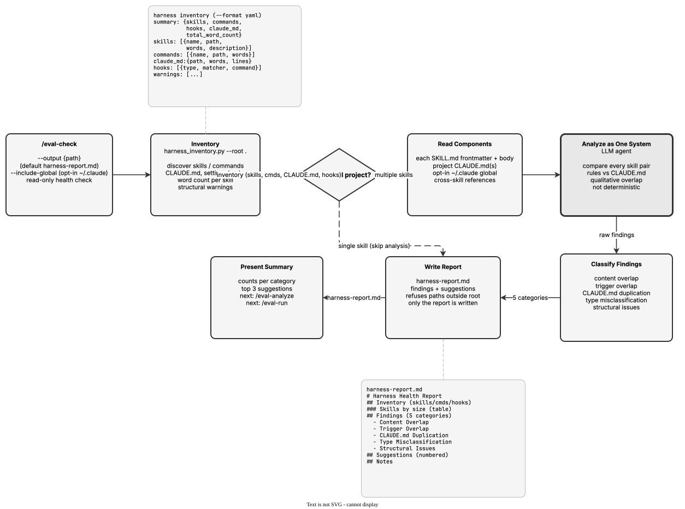

<!-- Auto-generated from registry.yaml. Do not edit directly. -->


# eval-check

Full-harness configuration health check. Inventories all skills, commands,
CLAUDE.md, and hooks (via harness_inventory.py), reads each skill's full
SKILL.md plus project CLAUDE.md files, and analyzes the configuration as a
single system. Produces an informational report with findings across five
categories: content overlap (duplicated rules between skills), trigger overlap
(descriptions that activate for the same tasks), CLAUDE.md duplication (rules
already in CLAUDE.md that are restated in skills), type misclassification
(skills that should be hooks, commands, or CLAUDE.md rules), and structural
issues (missing descriptions, overly broad triggers, commands shadowing
built-ins). Read-only -- modifies no skills/config and writes only the report
(refusing paths outside the project root). Skips cross-component analysis for
single-skill projects.

**Plugin**: [agent-eval-harness](index.md) | **:material-check: User-invocable**

## Contract

<div class="skill-contract">
  <header class="skill-contract__header">
    <span class="skill-contract__eyebrow">Skill Contract</span>
    <span class="skill-contract__version">canonical-skill-v1</span>
  </header>
  <p class="skill-contract__lede">Inventory a Claude Code harness and analyze its skills, commands, CLAUDE.md, and hooks as a single system to surface content overlap, trigger overlap, CLAUDE.md duplication, type misclassification, and structural issues, then produce an informational report with actionable restructuring suggestions without modifying any configuration.</p>
  <section class="skill-contract__section" data-section="01">
    <h3 class="skill-contract__section-title"><span class="skill-contract__section-name">Identity</span></h3>
    <div class="skill-contract__row">
      <span class="skill-contract__field">Functions</span>
      <div class="skill-contract__inline">
        <span class="skill-contract__chip skill-contract__chip--function">analyze</span>
        <span class="skill-contract__chip skill-contract__chip--function">review</span>
      </div>
    </div>
    <div class="skill-contract__row">
      <span class="skill-contract__field">Success</span>
      <ul class="skill-contract__list">
        <li>Runs the inventory script and reports the count of skills, commands, hooks, and CLAUDE.md presence with approximate per-skill word counts.</li>
        <li>Reads every discovered skill&#x27;s frontmatter and body plus project CLAUDE.md files (and ~/.claude/CLAUDE.md only when --include-global is passed).</li>
        <li>Produces cross-component findings in all five categories (content overlap, trigger overlap, CLAUDE.md duplication, type misclassification, structural issues), stating &#x27;none detected&#x27; where applicable.</li>
        <li>Writes the report to the --output path only when it resolves inside the project root, and presents a terminal summary with the top actionable suggestions and next steps.</li>
        <li>Short-circuits to inventory-only reporting when a single skill is found, noting cross-component analysis is not applicable.</li>
      </ul>
    </div>
  </section>
  <section class="skill-contract__section" data-section="02">
    <h3 class="skill-contract__section-title"><span class="skill-contract__section-name">Optimization Targets</span></h3>
    <div class="skill-contract__metrics">
      <div class="skill-contract__metric">
        <code class="skill-contract__metric-id">task_success</code>
        <span class="skill-contract__measure skill-contract__measure--judge">judge</span>
        <a class="skill-contract__ref" href="https://github.com/opendatahub-io/agent-eval-harness/blob/1559af5d404128ed3458d1a9bdb4580c76244b01/skills/eval-check/SKILL.md" title="opendatahub-io/agent-eval-harness@1559af5d404128ed3458d1a9bdb4580c76244b01:skills/eval-check/SKILL.md">SKILL.md @ 1559af5<span class="skill-contract__ref-arrow" aria-hidden="true">→</span></a>
      </div>
      <div class="skill-contract__metric">
        <code class="skill-contract__metric-id">evidence_completeness</code>
        <span class="skill-contract__measure skill-contract__measure--judge">judge</span>
        <a class="skill-contract__ref" href="https://github.com/opendatahub-io/agent-eval-harness/blob/1559af5d404128ed3458d1a9bdb4580c76244b01/skills/eval-check/SKILL.md" title="opendatahub-io/agent-eval-harness@1559af5d404128ed3458d1a9bdb4580c76244b01:skills/eval-check/SKILL.md">SKILL.md @ 1559af5<span class="skill-contract__ref-arrow" aria-hidden="true">→</span></a>
      </div>
    </div>
  </section>
  <section class="skill-contract__section" data-section="03">
    <h3 class="skill-contract__section-title"><span class="skill-contract__section-name">Invariants</span></h3>
    <div class="skill-contract__row">
      <span class="skill-contract__field">Must Preserve</span>
      <ul class="skill-contract__list">
        <li>Read-only: do not modify any skill, command, CLAUDE.md, hook, or other configuration file; only the report is written.</li>
        <li>Keep all findings informational suggestions; the user decides what to act on.</li>
        <li>Do not present LLM/qualitative judgments (word counts, overlap) as deterministic or precise measurements.</li>
        <li>Scan ~/.claude/CLAUDE.md only when --include-global is explicitly passed; otherwise note it was not scanned.</li>
        <li>Refuse to write the report to a path that resolves outside the project root and ask for a valid path.</li>
        <li>Skip unreadable files with a note rather than failing the whole report; back findings with concrete component references.</li>
      </ul>
    </div>
    <div class="skill-contract__row">
      <span class="skill-contract__field">Fixed Context</span>
      <div class="skill-contract__code">
      <div class="skill-contract__code-line"><span class="skill-contract__code-key">tools</span><span class="skill-contract__code-val">Read, Bash, Glob, Grep, Agent, AskUserQuestion, Write</span></div>
      <div class="skill-contract__code-line"><span class="skill-contract__code-key">cli</span><span class="skill-contract__code-val">python3</span></div>
      <div class="skill-contract__code-line"><span class="skill-contract__code-key">knowledge</span><span class="skill-contract__code-val">repository_content<span class="skill-contract__privacy">public</span>, task_input<span class="skill-contract__privacy">task_private</span>, tool_output<span class="skill-contract__privacy">task_private</span></span></div>
      </div>
    </div>
  </section>
  <section class="skill-contract__section" data-section="04">
    <h3 class="skill-contract__section-title"><span class="skill-contract__section-name">Traceability</span></h3>
    <div class="skill-contract__row">
      <span class="skill-contract__field">Skill</span>
      <div class="skill-contract__inline"><a class="skill-contract__path" href="https://github.com/opendatahub-io/agent-eval-harness/blob/1559af5d404128ed3458d1a9bdb4580c76244b01/skills/eval-check/SKILL.md"><span class="skill-contract__ref-arrow" aria-hidden="true">↗</span><code>skills/eval-check/SKILL.md</code></a></div>
    </div>
    <div class="skill-contract__row">
      <span class="skill-contract__field">Supporting</span>
      <ul class="skill-contract__paths">
        <li><a class="skill-contract__path" href="https://github.com/opendatahub-io/agent-eval-harness/blob/1559af5d404128ed3458d1a9bdb4580c76244b01/skills/eval-check/scripts/harness_inventory.py"><span class="skill-contract__ref-arrow" aria-hidden="true">↗</span><code>skills/eval-check/scripts/harness_inventory.py</code></a></li>
      </ul>
    </div>
  </section>
</div>

## Diagram

<div class="diagram-container" markdown>

</div>

## Arguments

```bash
/eval-check [--output <path>] [--include-global]
```

| Argument | Required | Default | Description |
|----------|----------|---------|-------------|
| `--output` |  | `harness-report.md` | Where to write the health check report. Must resolve within the project root. |
| `--include-global` |  | `false` | Also scan ~/.claude/CLAUDE.md (user-global config). Opt-in for privacy. |

## Usage

```bash
/eval-check
/eval-check --include-global
/eval-check --output eval/health-report.md
```
