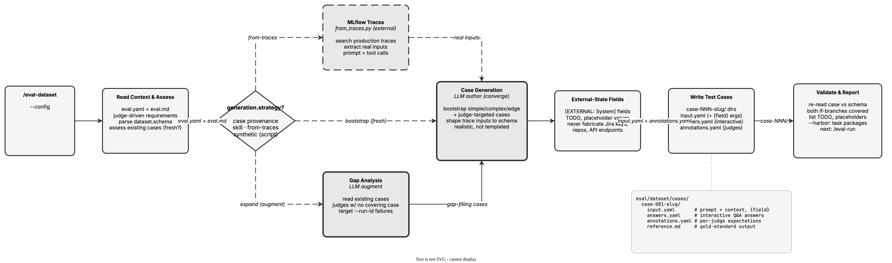

<!-- Auto-generated from registry.yaml. Do not edit directly. -->


# eval-dataset

Generates realistic test cases based on the eval.yaml dataset schema and
judge criteria. Reads eval.md and eval.yaml to derive judge-driven
requirements (each case should exercise at least one judge criterion), then
generates cases via one of three strategies: bootstrap (from scratch with
simple/complex/edge case coverage), expand (fills gaps in existing datasets
by analyzing what judges check that no case tests, optionally learning from a
previous run's failure patterns), and from-traces (extracts real inputs from
MLflow production traces). Handles external-state fields with TODO_
placeholders (so it never fabricates Jira keys, repos, or API endpoints),
generates answers.yaml guidance for interactive skills using AskUserQuestion,
and creates annotations.yaml for outcome-aware judges (ensuring conditional
judges are exercised on both branches). Can invoke /eval-analyze first when
no config exists.

**Plugin**: [agent-eval-harness](index.md) | **:material-check: User-invocable**

## Contract

<div class="skill-contract">
  <header class="skill-contract__header">
    <span class="skill-contract__eyebrow">Skill Contract</span>
    <span class="skill-contract__version">canonical-skill-v1</span>
  </header>
  <p class="skill-contract__lede">Produce evaluation test cases for an eval.yaml that match dataset.schema and exercise judge-driven requirements, sourcing them per generation.strategy (agent-authored from skill analysis, synthetic LLM generation from seeds, or extracted from MLflow production traces), either bootstrapping a fresh starter set or augmenting an existing one to close coverage gaps.</p>
  <section class="skill-contract__section" data-section="01">
    <h3 class="skill-contract__section-title"><span class="skill-contract__section-name">Identity</span></h3>
    <div class="skill-contract__row">
      <span class="skill-contract__field">Functions</span>
      <div class="skill-contract__inline">
        <span class="skill-contract__chip skill-contract__chip--function">generate</span>
      </div>
    </div>
    <div class="skill-contract__row">
      <span class="skill-contract__field">Success</span>
      <ul class="skill-contract__list">
        <li>Detects generation.strategy from the config (defaulting absent to &#x27;skill&#x27;) and routes to the matching provenance path (skill authoring, synthetic script, or from-traces extraction).</li>
        <li>Writes case directories under dataset.path whose files and fields conform exactly to dataset.schema, including every {field} referenced by execution.arguments in case mode.</li>
        <li>Derives fresh-vs-augment from the current dataset state (empty/thin -&gt; fresh starter set; populated -&gt; non-duplicating gap-fillers numbered after the highest existing case).</li>
        <li>Designs cases to cover distinct execution paths and judge-driven requirements, including simple, complex, and edge cases for a fresh set.</li>
        <li>Validates generated cases against the schema and reports provenance, coverage, remaining gaps, and any TODO_ external-state placeholders that must be replaced before running.</li>
        <li>When --harbor is passed, emits self-contained Harbor task packages for the generated cases.</li>
      </ul>
    </div>
  </section>
  <section class="skill-contract__section" data-section="02">
    <h3 class="skill-contract__section-title"><span class="skill-contract__section-name">Optimization Targets</span></h3>
    <div class="skill-contract__metrics">
      <div class="skill-contract__metric">
        <code class="skill-contract__metric-id">task_success</code>
        <span class="skill-contract__measure skill-contract__measure--judge">judge</span>
        <a class="skill-contract__ref" href="https://github.com/opendatahub-io/agent-eval-harness/blob/1559af5d404128ed3458d1a9bdb4580c76244b01/skills/eval-dataset/references/case-generation.md" title="opendatahub-io/agent-eval-harness@1559af5d404128ed3458d1a9bdb4580c76244b01:skills/eval-dataset/references/case-generation.md">case-generation.md @ 1559af5<span class="skill-contract__ref-arrow" aria-hidden="true">→</span></a>
      </div>
    </div>
  </section>
  <section class="skill-contract__section" data-section="03">
    <h3 class="skill-contract__section-title"><span class="skill-contract__section-name">Invariants</span></h3>
    <div class="skill-contract__row">
      <span class="skill-contract__field">Must Preserve</span>
      <ul class="skill-contract__list">
        <li>Match dataset.schema exactly -- do not change file names, formats, or field names the schema prescribes.</li>
        <li>Do not fabricate gold reference outputs when the correct output is uncertain -- omit references rather than include misleading ones.</li>
        <li>Do not invent values for [EXTERNAL: System] fields -- emit TODO_&lt;SYSTEM&gt;_&lt;FIELD&gt; placeholders and surface them in the report.</li>
        <li>Preserve provenance semantics: --count applies only to skill/from-traces paths and is ignored for synthetic (seed counts govern); do not override generation.strategy with a flag.</li>
        <li>When augmenting, do not duplicate existing cases; continue case numbering from the highest existing case.</li>
        <li>Generate realistic, varied content rather than lorem ipsum or obviously templated placeholders.</li>
      </ul>
    </div>
    <div class="skill-contract__row">
      <span class="skill-contract__field">Fixed Context</span>
      <div class="skill-contract__code">
      <div class="skill-contract__code-line"><span class="skill-contract__code-key">tools</span><span class="skill-contract__code-val">Read, Write, Edit, Bash, Glob, Grep, Agent, AskUserQuestion</span></div>
      <div class="skill-contract__code-line"><span class="skill-contract__code-key">cli</span><span class="skill-contract__code-val">python3</span></div>
      <div class="skill-contract__code-line"><span class="skill-contract__code-key">knowledge</span><span class="skill-contract__code-val">repository_content<span class="skill-contract__privacy">public</span>, task_input<span class="skill-contract__privacy">task_private</span>, tool_output<span class="skill-contract__privacy">task_private</span>, external_reference<span class="skill-contract__privacy">organization_private</span></span></div>
      </div>
    </div>
  </section>
  <section class="skill-contract__section" data-section="04">
    <h3 class="skill-contract__section-title"><span class="skill-contract__section-name">Traceability</span></h3>
    <div class="skill-contract__row">
      <span class="skill-contract__field">Skill</span>
      <div class="skill-contract__inline"><a class="skill-contract__path" href="https://github.com/opendatahub-io/agent-eval-harness/blob/1559af5d404128ed3458d1a9bdb4580c76244b01/skills/eval-dataset/SKILL.md"><span class="skill-contract__ref-arrow" aria-hidden="true">↗</span><code>skills/eval-dataset/SKILL.md</code></a></div>
    </div>
    <div class="skill-contract__row">
      <span class="skill-contract__field">Supporting</span>
      <ul class="skill-contract__paths">
        <li><a class="skill-contract__path" href="https://github.com/opendatahub-io/agent-eval-harness/blob/1559af5d404128ed3458d1a9bdb4580c76244b01/skills/eval-dataset/references/case-generation.md"><span class="skill-contract__ref-arrow" aria-hidden="true">↗</span><code>skills/eval-dataset/references/case-generation.md</code></a></li>
        <li><a class="skill-contract__path" href="https://github.com/opendatahub-io/agent-eval-harness/blob/1559af5d404128ed3458d1a9bdb4580c76244b01/skills/eval-dataset/references/synthetic-generation.md"><span class="skill-contract__ref-arrow" aria-hidden="true">↗</span><code>skills/eval-dataset/references/synthetic-generation.md</code></a></li>
        <li><a class="skill-contract__path" href="https://github.com/opendatahub-io/agent-eval-harness/blob/1559af5d404128ed3458d1a9bdb4580c76244b01/skills/eval-dataset/scripts/generate_synthetic.py"><span class="skill-contract__ref-arrow" aria-hidden="true">↗</span><code>skills/eval-dataset/scripts/generate_synthetic.py</code></a></li>
        <li><a class="skill-contract__path" href="https://github.com/opendatahub-io/agent-eval-harness/blob/1559af5d404128ed3458d1a9bdb4580c76244b01/skills/eval-dataset/scripts/harbor.py"><span class="skill-contract__ref-arrow" aria-hidden="true">↗</span><code>skills/eval-dataset/scripts/harbor.py</code></a></li>
        <li><a class="skill-contract__path" href="https://github.com/opendatahub-io/agent-eval-harness/blob/1559af5d404128ed3458d1a9bdb4580c76244b01/skills/eval-dataset/scripts/list_prompts.py"><span class="skill-contract__ref-arrow" aria-hidden="true">↗</span><code>skills/eval-dataset/scripts/list_prompts.py</code></a></li>
      </ul>
    </div>
  </section>
</div>

## Diagram

<div class="diagram-container" markdown>

</div>

## Arguments

```bash
/eval-dataset [--config <path>] [--count <N>] [--strategy <type>] [--run-id <id>]
```

| Argument | Required | Default | Description |
|----------|----------|---------|-------------|
| `--config` |  | `auto-discover` | Path to eval config. |
| `--count` |  | `5` | Number of test cases to generate. |
| `--strategy` |  | `bootstrap` | Generation strategy. bootstrap: from scratch. expand: fill gaps in existing dataset. from-traces: extract from MLflow traces (falls back to expand if none found). |
| `--run-id` |  | - | Previous eval run to learn from when filling coverage gaps (used with the expand strategy to target empirical failure patterns). |

## Usage

```bash
/eval-dataset
/eval-dataset --count 10 --strategy expand
/eval-dataset --strategy from-traces
```
