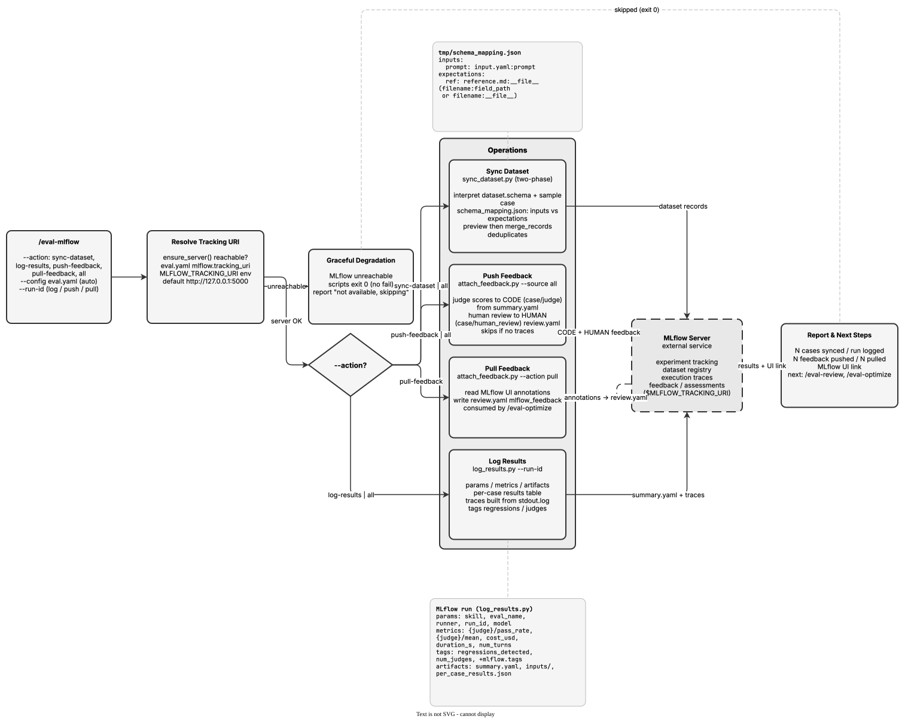

<!-- Auto-generated from registry.yaml. Do not edit directly. -->


# eval-mlflow

Bidirectional MLflow integration for evaluation results, datasets, and
feedback. Syncs test cases to the MLflow dataset registry using a two-phase
flow where you produce a schema_mapping.json (inputs vs expectations, mapping
record fields to source files/field paths) and a script syncs deterministically;
logs run params, metrics, artifacts, per-case results tables, and traces to
MLflow experiments; pushes judge scores (source_type=CODE) and human feedback
(source_type=HUMAN) to execution traces; and pulls annotations added via the
MLflow UI back into review.yaml (under mlflow_feedback) for /eval-optimize to
consume. Resolves tracking URI from mlflow.tracking_uri in eval.yaml, then the
MLFLOW_TRACKING_URI env var, then defaults to http://127.0.0.1:5000. Degrades
gracefully -- if MLflow is unavailable, scripts exit cleanly and the skill
reports that it was skipped.

**Plugin**: [agent-eval-harness](index.md) | **:material-check: User-invocable**

## Contract

<div class="skill-contract">
  <header class="skill-contract__header">
    <span class="skill-contract__eyebrow">Skill Contract</span>
    <span class="skill-contract__version">canonical-skill-v1</span>
  </header>
  <p class="skill-contract__lede">Bidirectionally integrate a file-based evaluation run with an external MLflow tracking server: sync case directories into an MLflow dataset via an agent-produced schema mapping, log a run&#x27;s params, metrics, artifacts, per-case table, and execution traces, and push/pull judge and human feedback to and from traces so downstream eval-optimize can consume it.</p>
  <section class="skill-contract__section" data-section="01">
    <h3 class="skill-contract__section-title"><span class="skill-contract__section-name">Identity</span></h3>
    <div class="skill-contract__row">
      <span class="skill-contract__field">Functions</span>
      <div class="skill-contract__inline">
        <span class="skill-contract__chip skill-contract__chip--function">execute</span>
      </div>
    </div>
    <div class="skill-contract__row">
      <span class="skill-contract__field">Success</span>
      <ul class="skill-contract__list">
        <li>sync-dataset builds MLflow records whose inputs vs expectations follow dataset.schema (not hardcoded field names) and reports RECORDS synced with STATUS synced.</li>
        <li>log-results logs params, per-judge and execution metrics, summary artifact, per-case results table, and one trace per case/step (or run) to the resolved experiment for the given --run-id.</li>
        <li>push-feedback attaches judge feedback (source_type CODE) and human review feedback (source_type HUMAN) to matching traces; pull-feedback writes external MLflow-UI annotations into review.yaml under mlflow_feedback.</li>
        <li>Tracking URI is resolved from eval.yaml mlflow.tracking_uri, then MLFLOW_TRACKING_URI, then the local default, and a reachability check is reported before acting.</li>
      </ul>
    </div>
  </section>
  <section class="skill-contract__section" data-section="02">
    <h3 class="skill-contract__section-title"><span class="skill-contract__section-name">Optimization Targets</span></h3>
    <div class="skill-contract__metrics">
      <div class="skill-contract__metric">
        <code class="skill-contract__metric-id">task_success</code>
        <span class="skill-contract__measure skill-contract__measure--deterministic">deterministic</span>
        <span class="skill-contract__ref-placeholder"></span>
      </div>
    </div>
  </section>
  <section class="skill-contract__section" data-section="03">
    <h3 class="skill-contract__section-title"><span class="skill-contract__section-name">Invariants</span></h3>
    <div class="skill-contract__row">
      <span class="skill-contract__field">Must Not</span>
      <ul class="skill-contract__list">
        <li>Graceful degradation: when MLflow is unavailable or unreachable the scripts exit 0 and the skill reports skipping, never failing the pipeline.</li>
        <li>Idempotent operations: re-running is safe (merge_records deduplicates, log_feedback overwrites); do not create duplicate datasets, runs, or feedback.</li>
        <li>Determine inputs vs expectations by reading dataset.schema, never by assuming or hardcoding field names.</li>
        <li>Trace feedback is optional: if no traces are found, report 0 and succeed rather than blocking.</li>
        <li>Preserve path-traversal guards (validate --run-id, reject absolute/.. paths and symlinks) when resolving run and harbor job directories.</li>
        <li>Do not modify the underlying eval case data or source skill being evaluated.</li>
      </ul>
    </div>
    <div class="skill-contract__row">
      <span class="skill-contract__field">Fixed Context</span>
      <div class="skill-contract__code">
      <div class="skill-contract__code-line"><span class="skill-contract__code-key">tools</span><span class="skill-contract__code-val">Read, Write, Edit, Bash, Glob, Grep, AskUserQuestion</span></div>
      <div class="skill-contract__code-line"><span class="skill-contract__code-key">cli</span><span class="skill-contract__code-val">python3</span></div>
      <div class="skill-contract__code-line"><span class="skill-contract__code-key">knowledge</span><span class="skill-contract__code-val">repository_content<span class="skill-contract__privacy">public</span>, task_input<span class="skill-contract__privacy">task_private</span>, tool_output<span class="skill-contract__privacy">task_private</span>, external_reference<span class="skill-contract__privacy">organization_private</span></span></div>
      </div>
    </div>
  </section>
  <section class="skill-contract__section" data-section="04">
    <h3 class="skill-contract__section-title"><span class="skill-contract__section-name">Traceability</span></h3>
    <div class="skill-contract__row">
      <span class="skill-contract__field">Skill</span>
      <div class="skill-contract__inline"><a class="skill-contract__path" href="https://github.com/opendatahub-io/agent-eval-harness/blob/v1.30.0/skills/eval-mlflow/SKILL.md"><span class="skill-contract__ref-arrow" aria-hidden="true">↗</span><code>skills/eval-mlflow/SKILL.md</code></a></div>
    </div>
    <div class="skill-contract__row">
      <span class="skill-contract__field">Supporting</span>
      <ul class="skill-contract__paths">
        <li><a class="skill-contract__path" href="https://github.com/opendatahub-io/agent-eval-harness/blob/v1.30.0/skills/eval-mlflow/scripts/sync_dataset.py"><span class="skill-contract__ref-arrow" aria-hidden="true">↗</span><code>skills/eval-mlflow/scripts/sync_dataset.py</code></a></li>
        <li><a class="skill-contract__path" href="https://github.com/opendatahub-io/agent-eval-harness/blob/v1.30.0/skills/eval-mlflow/scripts/log_results.py"><span class="skill-contract__ref-arrow" aria-hidden="true">↗</span><code>skills/eval-mlflow/scripts/log_results.py</code></a></li>
        <li><a class="skill-contract__path" href="https://github.com/opendatahub-io/agent-eval-harness/blob/v1.30.0/skills/eval-mlflow/scripts/attach_feedback.py"><span class="skill-contract__ref-arrow" aria-hidden="true">↗</span><code>skills/eval-mlflow/scripts/attach_feedback.py</code></a></li>
        <li><a class="skill-contract__path" href="https://github.com/opendatahub-io/agent-eval-harness/blob/v1.30.0/skills/eval-mlflow/scripts/from_traces.py"><span class="skill-contract__ref-arrow" aria-hidden="true">↗</span><code>skills/eval-mlflow/scripts/from_traces.py</code></a></li>
        <li><a class="skill-contract__path" href="https://github.com/opendatahub-io/agent-eval-harness/blob/v1.30.0/skills/eval-mlflow/scripts/trace_from_stdout.py"><span class="skill-contract__ref-arrow" aria-hidden="true">↗</span><code>skills/eval-mlflow/scripts/trace_from_stdout.py</code></a></li>
      </ul>
    </div>
  </section>
</div>

## Diagram

<div class="diagram-container" markdown>

</div>

## Arguments

```bash
/eval-mlflow [--action <action>] [--run-id <id>] [--config <path>]
```

| Argument | Required | Default | Description |
|----------|----------|---------|-------------|
| `--action` |  | `all` | Which sync action to perform. |
| `--run-id` |  | - | Which eval run to log or attach feedback to. Required for log-results, push-feedback, and pull-feedback. |
| `--config` |  | `auto-discover` | Path to eval config. |

## Usage

```bash
/eval-mlflow --run-id 2026-05-01-opus
/eval-mlflow --action sync-dataset
/eval-mlflow --run-id 2026-05-01-opus --action push-feedback
```
