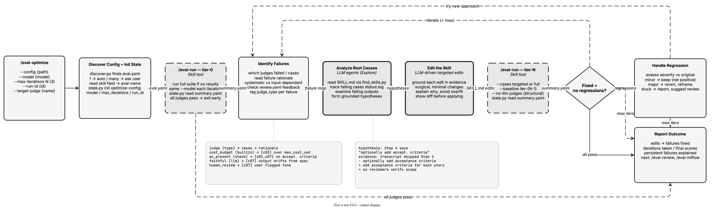

<!-- Auto-generated from registry.yaml. Do not edit directly. -->


# eval-optimize

Automated skill improvement loop that acts autonomously (no per-case human
input). Runs evaluation, identifies judge failures from summary.yaml, reads
execution transcripts and failing case outputs via Explore sub-agents to
trace root causes to specific SKILL.md instructions, makes surgical edits
grounded in evidence, re-runs evaluation with regression baseline checks
(targeting failing cases first, then a full run), handles regressions
(continue if minor, revert if major), and iterates up to a configurable
maximum. Also reads human feedback from review.yaml (from /eval-review) and
MLflow annotations to prioritize issues flagged by humans over automated judge
failures. Never edits judges, eval.yaml, or builtin judge code -- only the
skill under test. Stops when all judges pass or max iterations is reached, then
suggests logging results to MLflow.

**Plugin**: [agent-eval-harness](index.md) | **:material-check: User-invocable**

## Contract

<div class="skill-contract">
  <header class="skill-contract__header">
    <span class="skill-contract__eyebrow">Skill Contract</span>
    <span class="skill-contract__version">canonical-skill-v1</span>
  </header>
  <p class="skill-contract__lede">Autonomously improve a skill (or prompt-mode artifact) by looping over eval results: identify which judges failed and why from rationale and transcripts, form grounded hypotheses, apply surgical edits to the SKILL.md under test, re-run the eval, and check for regressions until judges pass or the max-iteration limit is reached.</p>
  <section class="skill-contract__section" data-section="01">
    <h3 class="skill-contract__section-title"><span class="skill-contract__section-name">Identity</span></h3>
    <div class="skill-contract__row">
      <span class="skill-contract__field">Functions</span>
      <div class="skill-contract__inline">
        <span class="skill-contract__chip skill-contract__chip--function">orchestrate</span>
        <span class="skill-contract__chip skill-contract__chip--function">transform</span>
      </div>
    </div>
    <div class="skill-contract__row">
      <span class="skill-contract__field">Success</span>
      <ul class="skill-contract__list">
        <li>Diagnoses each failing judge from summary.yaml rationale, transcripts, and case outputs before editing, noting judge_type (builtin/check/llm/code).</li>
        <li>Applies surgical, evidence-grounded edits to the target artifact under test (SKILL.md or prompt-mode artifact), not broad rewrites.</li>
        <li>Re-runs the eval with a --baseline flag and confirms targeted failures now pass while previously passing cases/judges do not regress.</li>
        <li>Iterates until all judges pass or max-iterations is hit, then reports which edits fixed which failures and the final summary.yaml scores.</li>
      </ul>
    </div>
  </section>
  <section class="skill-contract__section" data-section="02">
    <h3 class="skill-contract__section-title"><span class="skill-contract__section-name">Optimization Targets</span></h3>
    <div class="skill-contract__metrics">
      <div class="skill-contract__metric">
        <code class="skill-contract__metric-id">task_success</code>
        <span class="skill-contract__measure skill-contract__measure--verifier_backed">verifier_backed</span>
        <a class="skill-contract__ref" href="https://github.com/opendatahub-io/agent-eval-harness/blob/1559af5d404128ed3458d1a9bdb4580c76244b01/skills/eval-run/scripts/score.py" title="opendatahub-io/agent-eval-harness@1559af5d404128ed3458d1a9bdb4580c76244b01:skills/eval-run/scripts/score.py">score.py @ 1559af5<span class="skill-contract__ref-arrow" aria-hidden="true">→</span></a>
      </div>
    </div>
  </section>
  <section class="skill-contract__section" data-section="03">
    <h3 class="skill-contract__section-title"><span class="skill-contract__section-name">Invariants</span></h3>
    <div class="skill-contract__row">
      <span class="skill-contract__field">Must Preserve</span>
      <ul class="skill-contract__list">
        <li>Every edit must be grounded in a specific failure with evidence from judge rationale and transcripts -- never make broad, generic changes.</li>
        <li>Do not modify test cases, judges, or eval.yaml; the eval harness is ground truth. Never edit builtin judge code -- suggest adjusting arguments: instead.</li>
        <li>Check for regressions after every edit; a fix that breaks other cases is not a fix, and must be reverted or reframed.</li>
        <li>Stop after max-iterations rather than looping forever, and report what could not be fixed.</li>
        <li>Only edit the artifact under test (the SKILL.md or prompt-mode artifact); make minimal, surgical changes and do not rewrite working sections.</li>
      </ul>
    </div>
    <div class="skill-contract__row">
      <span class="skill-contract__field">Fixed Context</span>
      <div class="skill-contract__code">
      <div class="skill-contract__code-line"><span class="skill-contract__code-key">tools</span><span class="skill-contract__code-val">Read, Write, Edit, Bash, Glob, Grep, Agent, Skill, AskUserQuestion</span></div>
      <div class="skill-contract__code-line"><span class="skill-contract__code-key">cli</span><span class="skill-contract__code-val">python3</span></div>
      <div class="skill-contract__code-line"><span class="skill-contract__code-key">knowledge</span><span class="skill-contract__code-val">repository_content<span class="skill-contract__privacy">public</span>, tool_output<span class="skill-contract__privacy">task_private</span>, task_input<span class="skill-contract__privacy">task_private</span></span></div>
      </div>
    </div>
  </section>
  <section class="skill-contract__section" data-section="04">
    <h3 class="skill-contract__section-title"><span class="skill-contract__section-name">Traceability</span></h3>
    <div class="skill-contract__row">
      <span class="skill-contract__field">Skill</span>
      <div class="skill-contract__inline"><a class="skill-contract__path" href="https://github.com/opendatahub-io/agent-eval-harness/blob/1559af5d404128ed3458d1a9bdb4580c76244b01/skills/eval-optimize/SKILL.md"><span class="skill-contract__ref-arrow" aria-hidden="true">↗</span><code>skills/eval-optimize/SKILL.md</code></a></div>
    </div>
  </section>
</div>

## Diagram

<div class="diagram-container" markdown>

</div>

## Arguments

```bash
/eval-optimize [--config <path>] [--model <model>] [--max-iterations <N>] [--run-id <id>] [--target-judge <name>]
```

| Argument | Required | Default | Description |
|----------|----------|---------|-------------|
| `--config` |  | `auto-discover` | Path to eval config. |
| `--model` |  | `models.skill from config` | Model for skill execution. Pass the same model on every iteration for comparable results. |
| `--max-iterations` |  | `3` | Maximum optimization iterations before stopping. |
| `--run-id` |  | `auto-generated` | Base run ID. Iterations append -iter-N. |
| `--target-judge` |  | - | Focus optimization on a specific failing judge instead of all judges. |

## Usage

```bash
/eval-optimize
/eval-optimize --max-iterations 5 --model claude-opus-4-6
/eval-optimize --target-judge completeness
```
