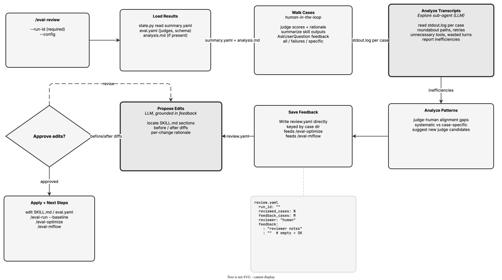

<!-- Auto-generated from registry.yaml. Do not edit directly. -->


# eval-review

Interactive human-in-the-loop review of evaluation results. Loads
summary.yaml and any /eval-run analysis.md, presents judge scores and skill
outputs case by case, collects qualitative feedback, and delegates transcript
analysis to Explore sub-agents to identify inefficiencies (roundabout paths,
multiple approaches, unnecessary tools, wasted turns). Identifies
judge-human alignment gaps and suggests new judge candidates, persists
feedback to review.yaml (keyed by case directory name for /eval-optimize and
/eval-mlflow to consume), and proposes targeted SKILL.md edits as before/after
diffs grounded in feedback evidence -- applied only with explicit approval.
Complements /eval-optimize (automated) by catching tone, intent, and UX
issues that judges cannot measure.

**Plugin**: [agent-eval-harness](index.md) | **:material-check: User-invocable**

## Contract

<div class="skill-contract">
  <header class="skill-contract__header">
    <span class="skill-contract__eyebrow">Skill Contract</span>
    <span class="skill-contract__version">canonical-skill-v1</span>
  </header>
  <p class="skill-contract__lede">Guide an interactive review of an eval run: present judge scores and skill outputs, collect human feedback on what judges missed, persist that feedback as review.yaml, and propose targeted, evidence-grounded improvements to the artifact under test (SKILL.md or a prompt-mode artifact) and to the judge config.</p>
  <section class="skill-contract__section" data-section="01">
    <h3 class="skill-contract__section-title"><span class="skill-contract__section-name">Identity</span></h3>
    <div class="skill-contract__row">
      <span class="skill-contract__field">Functions</span>
      <div class="skill-contract__inline">
        <span class="skill-contract__chip skill-contract__chip--function">review</span>
      </div>
    </div>
    <div class="skill-contract__row">
      <span class="skill-contract__field">Success</span>
      <ul class="skill-contract__list">
        <li>Loads the specified run&#x27;s summary, eval.yaml, and per-case results, and presents pass rates and case-level judge scores with rationale.</li>
        <li>Collects and persists human feedback to $AGENT_EVAL_RUNS_DIR/&lt;eval-name&gt;/&lt;id&gt;/review.yaml with feedback keys matching case directory names exactly.</li>
        <li>Identifies judge-human alignment and systematic vs edge-case patterns across the reviewed feedback.</li>
        <li>Proposes specific before/after edits to the artifact under test, each grounded in cited case feedback, and applies them only after explicit user approval.</li>
      </ul>
    </div>
  </section>
  <section class="skill-contract__section" data-section="02">
    <h3 class="skill-contract__section-title"><span class="skill-contract__section-name">Optimization Targets</span></h3>
    <div class="skill-contract__metrics">
      <div class="skill-contract__metric">
        <code class="skill-contract__metric-id">task_success</code>
        <span class="skill-contract__measure skill-contract__measure--judge">judge</span>
        <a class="skill-contract__ref" href="https://github.com/opendatahub-io/agent-eval-harness/blob/1559af5d404128ed3458d1a9bdb4580c76244b01/skills/eval-review/prompts/review-results.md" title="opendatahub-io/agent-eval-harness@1559af5d404128ed3458d1a9bdb4580c76244b01:skills/eval-review/prompts/review-results.md">review-results.md @ 1559af5<span class="skill-contract__ref-arrow" aria-hidden="true">&#x2192;</span></a>
      </div>
      <div class="skill-contract__metric">
        <code class="skill-contract__metric-id">evidence_completeness</code>
        <span class="skill-contract__measure skill-contract__measure--judge">judge</span>
        <a class="skill-contract__ref" href="https://github.com/opendatahub-io/agent-eval-harness/blob/1559af5d404128ed3458d1a9bdb4580c76244b01/skills/eval-review/prompts/review-results.md" title="opendatahub-io/agent-eval-harness@1559af5d404128ed3458d1a9bdb4580c76244b01:skills/eval-review/prompts/review-results.md">review-results.md @ 1559af5<span class="skill-contract__ref-arrow" aria-hidden="true">&#x2192;</span></a>
      </div>
    </div>
  </section>
  <section class="skill-contract__section" data-section="03">
    <h3 class="skill-contract__section-title"><span class="skill-contract__section-name">Invariants</span></h3>
    <div class="skill-contract__row">
      <span class="skill-contract__field">Must Preserve</span>
      <ul class="skill-contract__list">
        <li>Do not edit the artifact under test without explicit user approval; propose diffs, do not impose them.</li>
        <li>Keep human feedback separate from judge scores; the skill&#x27;s value is catching what judges miss.</li>
        <li>Write review.yaml directly with the Write tool (not state.py) and keep feedback keys identical to case directory names so /eval-optimize and /eval-mlflow can consume them.</li>
        <li>Do not flood context: summarize outputs and delegate large transcript analysis to an Agent rather than loading full files.</li>
        <li>Ground every proposed change and finding in concrete case evidence; do not invent issues unsupported by feedback.</li>
      </ul>
    </div>
    <div class="skill-contract__row">
      <span class="skill-contract__field">Fixed Context</span>
      <div class="skill-contract__code">
      <div class="skill-contract__code-line"><span class="skill-contract__code-key">tools</span><span class="skill-contract__code-val">Read, Write, Edit, Bash, Glob, Grep, Agent, AskUserQuestion, Skill</span></div>
      <div class="skill-contract__code-line"><span class="skill-contract__code-key">cli</span><span class="skill-contract__code-val">python3</span></div>
      <div class="skill-contract__code-line"><span class="skill-contract__code-key">knowledge</span><span class="skill-contract__code-val">repository_content<span class="skill-contract__privacy">public</span>, tool_output<span class="skill-contract__privacy">task_private</span>, task_input<span class="skill-contract__privacy">task_private</span></span></div>
      </div>
    </div>
  </section>
  <section class="skill-contract__section" data-section="04">
    <h3 class="skill-contract__section-title"><span class="skill-contract__section-name">Traceability</span></h3>
    <div class="skill-contract__row">
      <span class="skill-contract__field">Skill</span>
      <div class="skill-contract__inline"><a class="skill-contract__path" href="https://github.com/opendatahub-io/agent-eval-harness/blob/1559af5d404128ed3458d1a9bdb4580c76244b01/skills/eval-review/SKILL.md"><span class="skill-contract__ref-arrow" aria-hidden="true">&#x2197;</span><code>skills/eval-review/SKILL.md</code></a></div>
    </div>
    <div class="skill-contract__row">
      <span class="skill-contract__field">Supporting</span>
      <ul class="skill-contract__paths">
        <li><a class="skill-contract__path" href="https://github.com/opendatahub-io/agent-eval-harness/blob/1559af5d404128ed3458d1a9bdb4580c76244b01/skills/eval-review/prompts/review-results.md"><span class="skill-contract__ref-arrow" aria-hidden="true">&#x2197;</span><code>skills/eval-review/prompts/review-results.md</code></a></li>
      </ul>
    </div>
  </section>
</div>

## Diagram

<div class="diagram-container" markdown>

</div>

## Arguments

```bash
/eval-review --run-id <id> [--config <path>] [--cases <name> ...]
```

| Argument | Required | Default | Description |
|----------|----------|---------|-------------|
| `--run-id` | :material-check: | - | Which eval run to review. |
| `--config` |  | `auto-discover` | Path to eval config. |
| `--cases` |  | - | Exact case directory names to review (space-separated). Defaults to all cases. |

## Usage

```bash
/eval-review --run-id 2026-05-01-opus
/eval-review --run-id 2026-05-01-opus --cases case-003 case-005
```
