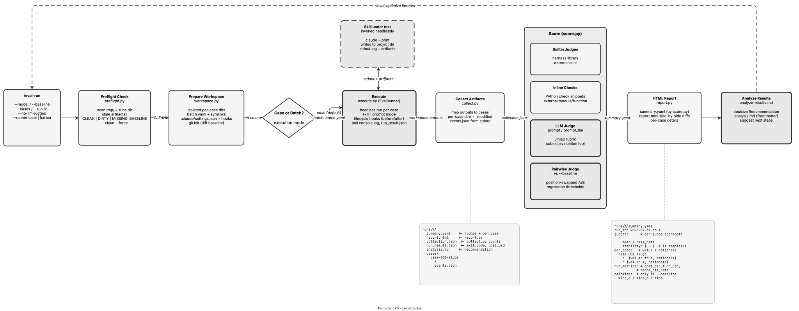

<!-- Auto-generated from registry.yaml. Do not edit directly. -->


# eval-run

Executes a skill against test cases, collects artifacts, scores with judges,
and generates an HTML report. Orchestrates via scripts: preflight checks for
stale artifacts, workspace creation with isolated per-case directories,
resolution of tool-interception handlers, headless skill execution (case
mode: once per case with case-specific arguments; batch mode: single
invocation via batch.yaml), artifact collection into per-case dirs, scoring
with four judge types (builtin, inline checks, LLM prompts, external
modules), optional pairwise comparison against a baseline for regression
detection, and report generation. Supports concurrent case execution via the
parallelism setting, tool interception for AskUserQuestion and external APIs,
configurable reasoning effort, and a --gold flag to save outputs as gold
references. Background-launches execute.py and monitors progress; persists
state via state.py and leads its analysis with a decisive recommendation.

**Plugin**: [agent-eval-harness](index.md) | **:material-check: User-invocable**

## Contract

<div class="skill-contract">
  <header class="skill-contract__header">
    <span class="skill-contract__eyebrow">Skill Contract</span>
    <span class="skill-contract__version">canonical-skill-v1</span>
  </header>
  <p class="skill-contract__lede">Run a skill or prompt evaluation end-to-end against a configured dataset: preflight-clean state, prepare an isolated workspace, execute cases headlessly, collect artifacts, score them with configured judges (deterministic and LLM), optionally run pairwise comparison against a baseline to detect regressions, and produce a decisive, evidence-backed analysis plus an HTML report. Requires an eval.yaml config produced by /eval-analyze; the skill orchestrates the pipeline scripts rather than reimplementing their work.</p>
  <section class="skill-contract__section" data-section="01">
    <h3 class="skill-contract__section-title"><span class="skill-contract__section-name">Identity</span></h3>
    <div class="skill-contract__row">
      <span class="skill-contract__field">Functions</span>
      <div class="skill-contract__inline">
        <span class="skill-contract__chip skill-contract__chip--function">execute</span>
        <span class="skill-contract__chip skill-contract__chip--function">verify</span>
      </div>
    </div>
    <div class="skill-contract__row">
      <span class="skill-contract__field">Success</span>
      <ul class="skill-contract__list">
        <li>Discovers or accepts an eval.yaml config, runs preflight, and sets up an isolated workspace with the resolved test cases before executing.</li>
        <li>Executes the eval headlessly in the correct auto-detected mode (skill mode with arguments, or prompt mode) and confirms run_result.json exit_code is zero before scoring.</li>
        <li>Collects per-case artifacts and runs every configured judge, honoring --no-llm-judges by skipping LLM judges while still running deterministic ones.</li>
        <li>Produces summary.yaml with per-judge means/pass-rates and per-case results, and when --baseline is given adds a pairwise regression comparison.</li>
        <li>Writes a decisive analysis.md leading with a self-contained Recommendation and generates the HTML report.</li>
      </ul>
    </div>
  </section>
  <section class="skill-contract__section" data-section="02">
    <h3 class="skill-contract__section-title"><span class="skill-contract__section-name">Optimization Targets</span></h3>
    <div class="skill-contract__metrics">
      <div class="skill-contract__metric">
        <code class="skill-contract__metric-id">task_success</code>
        <span class="skill-contract__measure skill-contract__measure--verifier_backed">verifier_backed</span>
        <a class="skill-contract__ref" href="https://github.com/opendatahub-io/agent-eval-harness/blob/1559af5d404128ed3458d1a9bdb4580c76244b01/skills/eval-run/scripts/score.py" title="opendatahub-io/agent-eval-harness@1559af5d404128ed3458d1a9bdb4580c76244b01:skills/eval-run/scripts/score.py">score.py @ 1559af5<span class="skill-contract__ref-arrow" aria-hidden="true">→</span></a>
      </div>
      <div class="skill-contract__metric">
        <code class="skill-contract__metric-id">evidence_completeness</code>
        <span class="skill-contract__measure skill-contract__measure--judge">judge</span>
        <a class="skill-contract__ref" href="https://github.com/opendatahub-io/agent-eval-harness/blob/1559af5d404128ed3458d1a9bdb4580c76244b01/skills/eval-run/prompts/analyze-results.md" title="opendatahub-io/agent-eval-harness@1559af5d404128ed3458d1a9bdb4580c76244b01:skills/eval-run/prompts/analyze-results.md">analyze-results.md @ 1559af5<span class="skill-contract__ref-arrow" aria-hidden="true">→</span></a>
      </div>
    </div>
  </section>
  <section class="skill-contract__section" data-section="03">
    <h3 class="skill-contract__section-title"><span class="skill-contract__section-name">Invariants</span></h3>
    <div class="skill-contract__row">
      <span class="skill-contract__field">Must Preserve</span>
      <ul class="skill-contract__list">
        <li>Orchestrate by calling the pipeline scripts (preflight, workspace, execute, collect, score, report); never duplicate or reimplement their scoring/execution logic.</li>
        <li>Launch execute.py in the background with no output redirection (no &gt;, |, tee, or 2&gt;&amp;1) and poll until completion; do not end the turn while it runs.</li>
        <li>Fail fast: if execution produces no artifacts or a non-zero exit_code, report it and stop rather than scoring empty outputs.</li>
        <li>Never read large artifact files into context; rely on summary.yaml and delegate content analysis to agents.</li>
        <li>When inputs.tools is configured, resolve every tool handler (input_filters for Bash) before executing; do not skip this mandatory step.</li>
        <li>Honor run isolation: do not overwrite a prior run&#x27;s results without cleaning, and persist state via state.py at each step.</li>
      </ul>
    </div>
    <div class="skill-contract__row">
      <span class="skill-contract__field">Fixed Context</span>
      <div class="skill-contract__code">
      <div class="skill-contract__code-line"><span class="skill-contract__code-key">tools</span><span class="skill-contract__code-val">Read, Write, Edit, Bash, Glob, Grep, Agent, Skill, AskUserQuestion</span></div>
      <div class="skill-contract__code-line"><span class="skill-contract__code-key">cli</span><span class="skill-contract__code-val">python3</span></div>
      <div class="skill-contract__code-line"><span class="skill-contract__code-key">knowledge</span><span class="skill-contract__code-val">repository_content<span class="skill-contract__privacy">public</span>, task_input<span class="skill-contract__privacy">task_private</span>, tool_output<span class="skill-contract__privacy">task_private</span></span></div>
      </div>
    </div>
  </section>
  <section class="skill-contract__section" data-section="04">
    <h3 class="skill-contract__section-title"><span class="skill-contract__section-name">Traceability</span></h3>
    <div class="skill-contract__row">
      <span class="skill-contract__field">Skill</span>
      <div class="skill-contract__inline"><a class="skill-contract__path" href="https://github.com/opendatahub-io/agent-eval-harness/blob/1559af5d404128ed3458d1a9bdb4580c76244b01/skills/eval-run/SKILL.md"><span class="skill-contract__ref-arrow" aria-hidden="true">↗</span><code>skills/eval-run/SKILL.md</code></a></div>
    </div>
    <div class="skill-contract__row">
      <span class="skill-contract__field">Supporting</span>
      <ul class="skill-contract__paths">
        <li><a class="skill-contract__path" href="https://github.com/opendatahub-io/agent-eval-harness/blob/1559af5d404128ed3458d1a9bdb4580c76244b01/skills/eval-run/scripts/execute.py"><span class="skill-contract__ref-arrow" aria-hidden="true">↗</span><code>skills/eval-run/scripts/execute.py</code></a></li>
        <li><a class="skill-contract__path" href="https://github.com/opendatahub-io/agent-eval-harness/blob/1559af5d404128ed3458d1a9bdb4580c76244b01/skills/eval-run/scripts/score.py"><span class="skill-contract__ref-arrow" aria-hidden="true">↗</span><code>skills/eval-run/scripts/score.py</code></a></li>
        <li><a class="skill-contract__path" href="https://github.com/opendatahub-io/agent-eval-harness/blob/1559af5d404128ed3458d1a9bdb4580c76244b01/skills/eval-run/scripts/collect.py"><span class="skill-contract__ref-arrow" aria-hidden="true">↗</span><code>skills/eval-run/scripts/collect.py</code></a></li>
        <li><a class="skill-contract__path" href="https://github.com/opendatahub-io/agent-eval-harness/blob/1559af5d404128ed3458d1a9bdb4580c76244b01/skills/eval-run/scripts/report.py"><span class="skill-contract__ref-arrow" aria-hidden="true">↗</span><code>skills/eval-run/scripts/report.py</code></a></li>
        <li><a class="skill-contract__path" href="https://github.com/opendatahub-io/agent-eval-harness/blob/1559af5d404128ed3458d1a9bdb4580c76244b01/skills/eval-run/scripts/preflight.py"><span class="skill-contract__ref-arrow" aria-hidden="true">↗</span><code>skills/eval-run/scripts/preflight.py</code></a></li>
        <li><a class="skill-contract__path" href="https://github.com/opendatahub-io/agent-eval-harness/blob/1559af5d404128ed3458d1a9bdb4580c76244b01/skills/eval-run/prompts/analyze-results.md"><span class="skill-contract__ref-arrow" aria-hidden="true">↗</span><code>skills/eval-run/prompts/analyze-results.md</code></a></li>
        <li><a class="skill-contract__path" href="https://github.com/opendatahub-io/agent-eval-harness/blob/1559af5d404128ed3458d1a9bdb4580c76244b01/skills/eval-run/prompts/comparison-judge.md"><span class="skill-contract__ref-arrow" aria-hidden="true">↗</span><code>skills/eval-run/prompts/comparison-judge.md</code></a></li>
        <li><a class="skill-contract__path" href="https://github.com/opendatahub-io/agent-eval-harness/blob/1559af5d404128ed3458d1a9bdb4580c76244b01/skills/eval-run/references/execution-modes.md"><span class="skill-contract__ref-arrow" aria-hidden="true">↗</span><code>skills/eval-run/references/execution-modes.md</code></a></li>
      </ul>
    </div>
  </section>
</div>

## Diagram

<div class="diagram-container" markdown>

</div>

## Arguments

```bash
/eval-run [--config <path>] [--model <model>] [--run-id <id>] [--baseline <run-id>] [--cases <id> ...] [--no-llm-judges] [--gold] [--effort <level>] [--subagent-model <model>] [--skill <name>]
```

| Argument | Required | Default | Description |
|----------|----------|---------|-------------|
| `--config` |  | `auto-discover` | Path to eval config. If missing, bootstraps via /eval-analyze. |
| `--model` |  | `models.skill from config` | Model for skill execution. Required if models.skill is unset in eval.yaml. |
| `--subagent-model` |  | `models.subagent, falls back to skill model` | Model for subagents (e.g., claude-sonnet-4-6 while main is claude-opus-4-7). |
| `--run-id` |  | `YYYY-MM-DD-<model>` | Identifier for this run. |
| `--cases` |  | - | Exact case IDs to run (space-separated). Defaults to all cases. |
| `--baseline` |  | - | Previous run to compare against for regression detection via pairwise comparison. Must exist under the same eval-name directory. |
| `--no-llm-judges` |  | `false` | Skip LLM judges (prompt, prompt_file, LLM builtins). Run deterministic judges only (check, Python builtins, external code). |
| `--gold` |  | `false` | Save collected outputs as gold reference files in the dataset case dirs after the run. |
| `--effort` |  | `runner.effort from config` | Claude Code reasoning effort level (Claude Code only; ignored by other runners). |
| `--skill` |  | `from config` | Override the skill to test. |

## Usage

```bash
/eval-run --model claude-opus-4-6
/eval-run --model claude-opus-4-6 --baseline 2026-05-01-opus
/eval-run --cases case-001 case-002 --no-llm-judges
/eval-run --gold
```
