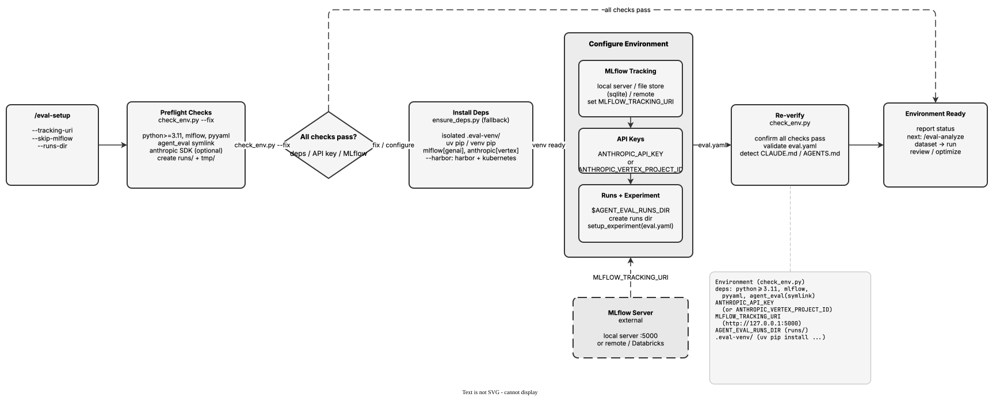

<!-- Auto-generated from registry.yaml. Do not edit directly. -->


# eval-setup

Optional, non-destructive environment configurator for the evaluation
harness. Installs dependencies into the isolated venv (as a fallback for
mid-session installs or troubleshooting), configures MLflow tracking (local
server, local file store, or remote/Databricks), verifies API keys
(Anthropic API or Vertex AI), sets up the runs directory, checks
skill-specific environment variables referenced in eval.yaml's
execution.env, and creates the MLflow experiment. Runs check_env.py
preflight checks (with --fix) and re-verifies at the end. Most users can
skip this -- dependencies auto-install via the plugin's SessionStart hook
and agent_eval is available via symlinks.

**Plugin**: [agent-eval-harness](index.md) | **:material-check: User-invocable**

## Contract

<div class="skill-contract">
  <header class="skill-contract__header">
    <span class="skill-contract__eyebrow">Skill Contract</span>
    <span class="skill-contract__version">canonical-skill-v1</span>
  </header>
  <p class="skill-contract__lede">Verify and optionally configure the agent-eval-harness environment: check Python/dependencies/API keys/MLflow, set up MLflow tracking and the runs directory, and suggest available evaluation modes based on repository contents.</p>
  <section class="skill-contract__section" data-section="01">
    <h3 class="skill-contract__section-title"><span class="skill-contract__section-name">Identity</span></h3>
    <div class="skill-contract__row">
      <span class="skill-contract__field">Functions</span>
      <div class="skill-contract__inline">
        <span class="skill-contract__chip skill-contract__chip--function">execute</span>
      </div>
    </div>
    <div class="skill-contract__row">
      <span class="skill-contract__field">Success</span>
      <ul class="skill-contract__list">
        <li>check_env.py preflight passes: Python &gt;= 3.11, mlflow/pyyaml/agent_eval importable, and API key or Vertex project set.</li>
        <li>MLflow tracking is configured (or explicitly skipped) and the runs directory exists.</li>
        <li>If eval.yaml exists, it validates and any configured MLflow experiment is created.</li>
        <li>Reports final environment status and suggests correct next steps along the analyze -&gt; dataset -&gt; run -&gt; review/optimize -&gt; mlflow pipeline.</li>
      </ul>
    </div>
  </section>
  <section class="skill-contract__section" data-section="02">
    <h3 class="skill-contract__section-title"><span class="skill-contract__section-name">Optimization Targets</span></h3>
    <div class="skill-contract__metrics">
      <div class="skill-contract__metric">
        <code class="skill-contract__metric-id">task_success</code>
        <span class="skill-contract__measure skill-contract__measure--verifier_backed">verifier_backed</span>
        <a class="skill-contract__ref" href="https://github.com/opendatahub-io/agent-eval-harness/blob/1559af5d404128ed3458d1a9bdb4580c76244b01/skills/eval-setup/scripts/check_env.py" title="opendatahub-io/agent-eval-harness@1559af5d404128ed3458d1a9bdb4580c76244b01:skills/eval-setup/scripts/check_env.py">check_env.py @ 1559af5<span class="skill-contract__ref-arrow" aria-hidden="true">→</span></a>
      </div>
    </div>
  </section>
  <section class="skill-contract__section" data-section="03">
    <h3 class="skill-contract__section-title"><span class="skill-contract__section-name">Invariants</span></h3>
    <div class="skill-contract__row">
      <span class="skill-contract__field">Must Preserve</span>
      <ul class="skill-contract__list">
        <li>Non-destructive: skip steps already done and do not overwrite existing configuration or env vars.</li>
        <li>Treat MLflow as optional -- never fail setup when MLflow cannot be configured; fall back to local file store.</li>
        <li>Do not leak credential values: mask literal env values and report API keys only as set/not-set.</li>
        <li>Honor --skip-mlflow, --tracking-uri, --runs-dir, and --harbor argument semantics.</li>
        <li>Report each check clearly with pass/fail status and a concrete fix for every failure.</li>
      </ul>
    </div>
    <div class="skill-contract__row">
      <span class="skill-contract__field">Fixed Context</span>
      <div class="skill-contract__code">
      <div class="skill-contract__code-line"><span class="skill-contract__code-key">tools</span><span class="skill-contract__code-val">Read, Bash, Glob, AskUserQuestion</span></div>
      <div class="skill-contract__code-line"><span class="skill-contract__code-key">cli</span><span class="skill-contract__code-val">python3</span></div>
      <div class="skill-contract__code-line"><span class="skill-contract__code-key">knowledge</span><span class="skill-contract__code-val">repository_content<span class="skill-contract__privacy">public</span>, tool_output<span class="skill-contract__privacy">task_private</span>, task_input<span class="skill-contract__privacy">task_private</span></span></div>
      </div>
    </div>
  </section>
  <section class="skill-contract__section" data-section="04">
    <h3 class="skill-contract__section-title"><span class="skill-contract__section-name">Traceability</span></h3>
    <div class="skill-contract__row">
      <span class="skill-contract__field">Skill</span>
      <div class="skill-contract__inline"><a class="skill-contract__path" href="https://github.com/opendatahub-io/agent-eval-harness/blob/1559af5d404128ed3458d1a9bdb4580c76244b01/skills/eval-setup/SKILL.md"><span class="skill-contract__ref-arrow" aria-hidden="true">↗</span><code>skills/eval-setup/SKILL.md</code></a></div>
    </div>
    <div class="skill-contract__row">
      <span class="skill-contract__field">Supporting</span>
      <ul class="skill-contract__paths">
        <li><a class="skill-contract__path" href="https://github.com/opendatahub-io/agent-eval-harness/blob/1559af5d404128ed3458d1a9bdb4580c76244b01/skills/eval-setup/scripts/check_env.py"><span class="skill-contract__ref-arrow" aria-hidden="true">↗</span><code>skills/eval-setup/scripts/check_env.py</code></a></li>
      </ul>
    </div>
  </section>
</div>

## Diagram

<div class="diagram-container" markdown>

</div>

## Arguments

```bash
/eval-setup [--tracking-uri <uri>] [--skip-mlflow] [--runs-dir <path>]
```

| Argument | Required | Default | Description |
|----------|----------|---------|-------------|
| `--tracking-uri` |  | `auto-detect` | MLflow tracking URI (skips interactive setup). Accepts local or remote URIs. |
| `--skip-mlflow` |  | `false` | Skip MLflow setup entirely. The harness works without MLflow. |
| `--runs-dir` |  | `eval/runs` | Directory where eval runs are stored. Configured via AGENT_EVAL_RUNS_DIR env var. |

## Usage

```bash
/eval-setup
/eval-setup --tracking-uri http://127.0.0.1:5000
/eval-setup --skip-mlflow
```
