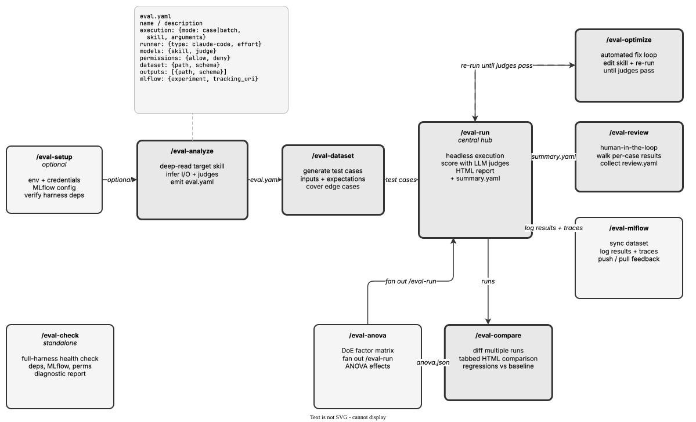

<!-- Auto-generated from registry.yaml. Do not edit directly. -->


# agent-eval-harness

Generic agentic evaluation framework for Claude Code skills. Provides an
end-to-end pipeline to analyze skills, generate test cases, execute evaluations,
review results with human feedback, compare models and configurations, run
Design-of-Experiments (DoE) sweeps with ANOVA statistics, sync with MLflow, and
iteratively optimize skill quality with regression checks.

The framework is schema-driven via eval.yaml, which defines execution mode
(case-by-case or batch), dataset schemas, output descriptions, judges (four
types: builtin reusable judges, inline check scripts, LLM prompts, and external
modules), model selection per role (skill, subagent, judge, hook), thresholds
for regression detection, and tool interception handlers. Supports
AskUserQuestion answering via 3-tier resolution (exact case_overrides, then an
LLM call using models.hook with the case's input.yaml + answers.yaml as context,
then fallback to the first option) and annotation-aware judges that adapt scoring
based on expected outcomes per test case.

Config auto-discovery (via discover.py) finds eval.yaml configs across
nested and flat directory layouts, so skills no longer require an explicit
--config path. A harness health-check skill (eval-check) scans all skills,
commands, CLAUDE.md, and hooks for redundancy, overlap, and structural issues.

The harness also integrates with EvalHub for running evaluations on Red Hat
OpenShift AI via a custom provider adapter (FrameworkAdapter from eval-hub-sdk),
supporting S3-hosted datasets, eval.yaml-to-provider translation, and
containerized (UBI9) execution.


!!! info "Plugin Details"

    - **Version**: 1.30.0
    - **Author**: Antonin Stefanutti
    - **Scope**: Generic
    - **Category**: [Evaluation & Testing](../../categories/evaluation.md)
    - **Repository**: [opendatahub-io/agent-eval-harness](https://github.com/opendatahub-io/agent-eval-harness)
    - **Tags**: <span class="tag-pill">evaluation</span> <span class="tag-pill">testing</span> <span class="tag-pill">skills</span> <span class="tag-pill">agents</span> <span class="tag-pill">mlflow</span> <span class="tag-pill">optimization</span> <span class="tag-pill">scoring</span> <span class="tag-pill">comparison</span> <span class="tag-pill">doe</span> <span class="tag-pill">anova</span>

## Pipeline

<div class="diagram-container" markdown>

</div>

## Skills

| Skill | Description | Invocable |
|-------|-------------|-----------|
| [`/eval-setup`](eval-setup.md) | Optional environment configurator that verifies dependencies, API keys, and MLflow tracking for the agent-eval-harness and suggests evaluation modes based on repository contents. | :material-check: |
| [`/eval-analyze`](eval-analyze.md) | Deep-reads a target skill (or runs a custom analysis prompt) and generates a complete, grounded eval.yaml with dataset schema, outputs, judges, models, and thresholds. | :material-check: |
| [`/eval-dataset`](eval-dataset.md) | Generates evaluation test cases for an eval.yaml -- from skill analysis, synthetic LLM generation, or MLflow traces -- bootstrapping or augmenting a dataset for /eval-run. | :material-check: |
| [`/eval-run`](eval-run.md) | Executes an evaluation against test cases in skill or prompt mode, scores outputs with judges, detects regressions against a baseline, and reports results. | :material-check: |
| [`/eval-compare`](eval-compare.md) | Discovers a directory of eval run artifacts and generates a self-contained tabbed HTML comparison report with model cards, quality/cost tables, per-case breakdowns, and LLM-written analysis. | :material-check: |
| [`/eval-anova`](eval-anova.md) | Fan a DoE matrix of agent configs across shared cases, then run repeated-measures/mixed-effects ANOVA (F, p, effect size) plus a cost/quality Pareto. | :material-check: |
| [`/eval-review`](eval-review.md) | Interactive human-in-the-loop review of eval judge scores and skill outputs that captures qualitative feedback and proposes targeted SKILL.md improvements. | :material-check: |
| [`/eval-mlflow`](eval-mlflow.md) | Bridges the evaluation harness with MLflow: syncs datasets, logs run params/metrics/traces, and pushes/pulls judge and human feedback bidirectionally. | :material-check: |
| [`/eval-optimize`](eval-optimize.md) | Automated skill-improvement loop: runs evals, diagnoses judge failures from traces, edits the SKILL.md, re-runs, and iterates until judges pass without regressions. | :material-check: |
| [`/eval-check`](eval-check.md) | Scans a Claude Code harness (skills, commands, CLAUDE.md, hooks) as a system and reports redundancy, trigger overlap, misclassification, and structural issues. | :material-check: |

## Installation

**Claude Code**

```bash
/plugin install agent-eval-harness@opendatahub-skills
```

**OpenAI Codex** — add the marketplace, then enable `agent-eval-harness` from the `/plugins` browser:

```bash
codex plugin marketplace add opendatahub-io/skills-registry
```

## Architecture

Ten skills form a linear pipeline with feedback loops: setup (optional) ->
analyze -> dataset -> run -> review/optimize, with mlflow available at any
point after run. eval-compare renders cross-model/cross-run comparison reports
from a directory of runs, and eval-anova is a Design-of-Experiments orchestrator
that fans /eval-run out across a matrix of configurations (models, effort,
prompts) and computes repeated-measures ANOVA + a cost/quality Pareto frontier,
which eval-compare surfaces automatically. eval-check operates standalone as a
cross-component health check. eval-run is the central hub -- it executes skills
headlessly,
runs judges (builtin + inline checks + LLM scoring + external modules, plus
pairwise comparison against a baseline), and produces summary.yaml consumed by
review, optimize, and mlflow. Builtin judges are reusable, versioned judges from
the agent_eval/judges/ library, parameterizable via an arguments dict and
listable with list_builtins.py.

eval-run orchestrates a chain of helper scripts rather than doing the work
itself: discover.py (config) -> preflight.py (stale-artifact check) ->
workspace.py (isolated per-case workspace + batch.yaml + symlinks) -> execute.py
(headless skill execution via the EvalRunner abstraction, with optional
parallelism, subagent models, and reasoning effort) -> collect.py (artifact
distribution into per-case dirs) -> score.py (judges + pairwise) -> report.py
(HTML report). State persists across context compression via state.py, a
key-value store. The EvalRunner ABC has a Claude Code implementation
(claude --print, stream-json capture) and an opaque CLI runner, making the
harness agent-agnostic.

eval-optimize creates a closed loop by reading judge rationale and execution
transcripts (via Explore sub-agents), forming hypotheses about SKILL.md
deficiencies, making surgical edits, and re-running eval-run with regression
baseline checks until judges pass or max iterations is hit. It never edits
judges, eval.yaml, or builtin judge code -- only the skill under test.
eval-review complements this with human-in-the-loop feedback that catches
qualitative issues judges miss (tone, intent, UX), persisting results to
review.yaml. eval-mlflow provides bidirectional sync -- pushing datasets,
results, traces, and feedback to MLflow experiment tracking and pulling
annotations back into review.yaml for optimization.

Scripts live alongside each skill and share the agent_eval Python package
(auto-installed via SessionStart hook into an isolated venv at .eval-venv/).
The data flow is: eval.yaml config -> workspace creation (isolated per run) ->
skill execution via EvalRunner -> artifact collection -> judge scoring ->
summary.yaml + HTML report.
