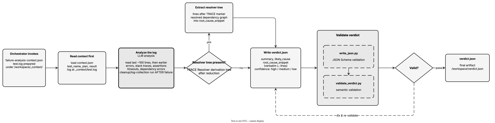

<!-- Auto-generated from registry.yaml. Do not edit directly. -->


# failure-analysis

Read a CI/CD test failure log and identify the root cause, producing a
structured verdict. Loads `failure-analysis-context.json` (test name, plan,
result) and the raw `test.log`, then analyzes the log -- starting from the
last ~100 lines where errors usually appear, but reading earlier because
tests perform cleanup and log collection *after* the real failure. It looks
for error messages, stack traces, assertion failures, timeouts, and
dependency errors, and specifically extracts `TRACE Resolver derivation
tree after reduction` blocks as critical context for dependency-resolution
failures. The verdict captures a 1-2 sentence summary, a concise
`likely_cause` category, a `root_cause_snippet` of verbatim log lines each
prefixed with its `L<num>:` line number (never paraphrased), and a
confidence rating of high/medium/low. Output is schema- then
semantically-validated and repaired until both pass.

**Plugin**: [autoqa-skills](index.md) | **:material-close: Internal**

## Contract

<div class="skill-contract">
  <header class="skill-contract__header">
    <span class="skill-contract__eyebrow">Skill Contract</span>
    <span class="skill-contract__version">canonical-skill-v1</span>
  </header>
  <p class="skill-contract__lede">Read a CI/CD test failure log, identify the root cause of the failure, and produce a structured JSON verdict with summary, likely cause, verbatim log snippet with line numbers, and confidence rating.</p>
  <section class="skill-contract__section" data-section="01">
    <h3 class="skill-contract__section-title"><span class="skill-contract__section-name">Identity</span></h3>
    <div class="skill-contract__row">
      <span class="skill-contract__field">Functions</span>
      <div class="skill-contract__inline">
        <span class="skill-contract__chip skill-contract__chip--function">analyze</span>
      </div>
    </div>
    <div class="skill-contract__row">
      <span class="skill-contract__field">Success</span>
      <ul class="skill-contract__list">
        <li>Produces /workspace/verdict.json with summary, likely_cause, root_cause_snippet, and confidence fields.</li>
        <li>root_cause_snippet contains verbatim log lines prefixed with line numbers in L&lt;num&gt; format.</li>
        <li>verdict.json passes JSON Schema validation via write_json.py and semantic validation via validate_verdict.py.</li>
      </ul>
    </div>
  </section>
  <section class="skill-contract__section" data-section="02">
    <h3 class="skill-contract__section-title"><span class="skill-contract__section-name">Optimization Targets</span></h3>
    <div class="skill-contract__metrics">
      <div class="skill-contract__metric">
        <code class="skill-contract__metric-id">task_success</code>
        <span class="skill-contract__measure skill-contract__measure--deterministic">deterministic</span>
        <span class="skill-contract__ref-placeholder"></span>
      </div>
    </div>
  </section>
  <section class="skill-contract__section" data-section="03">
    <h3 class="skill-contract__section-title"><span class="skill-contract__section-name">Invariants</span></h3>
    <div class="skill-contract__row">
      <span class="skill-contract__field">Must Preserve</span>
      <ul class="skill-contract__list">
        <li>Do not modify the test log or any source files.</li>
        <li>Copy log lines verbatim with line-number prefixes, do not paraphrase.</li>
      </ul>
    </div>
    <div class="skill-contract__row">
      <span class="skill-contract__field">Fixed Context</span>
      <div class="skill-contract__code">
      <div class="skill-contract__code-line"><span class="skill-contract__code-key">tools</span><span class="skill-contract__code-val">Bash, Read, Write, Grep, Glob</span></div>
      <div class="skill-contract__code-line"><span class="skill-contract__code-key">knowledge</span><span class="skill-contract__code-val">task_input<span class="skill-contract__privacy">task_private</span></span></div>
      </div>
    </div>
  </section>
  <section class="skill-contract__section" data-section="04">
    <h3 class="skill-contract__section-title"><span class="skill-contract__section-name">Traceability</span></h3>
    <div class="skill-contract__row">
      <span class="skill-contract__field">Skill</span>
      <div class="skill-contract__inline"><a class="skill-contract__path" href="https://github.com/opendatahub-io/autoqa-skills/blob/main/skills/failure-analysis/SKILL.md"><span class="skill-contract__ref-arrow" aria-hidden="true">&#x2197;</span><code>skills/failure-analysis/SKILL.md</code></a></div>
    </div>
  </section>
</div>

## Diagram

<div class="diagram-container" markdown>

</div>

## Usage

```bash
# Invoked by the AutoQA orchestrator inside the agentic-ci runner (internal skill)
# Inputs:  /workspace/_context/failure-analysis-context.json  +  /workspace/_context/test.log
# Output:  /workspace/verdict.json  { summary, likely_cause, root_cause_snippet, confidence }
```
