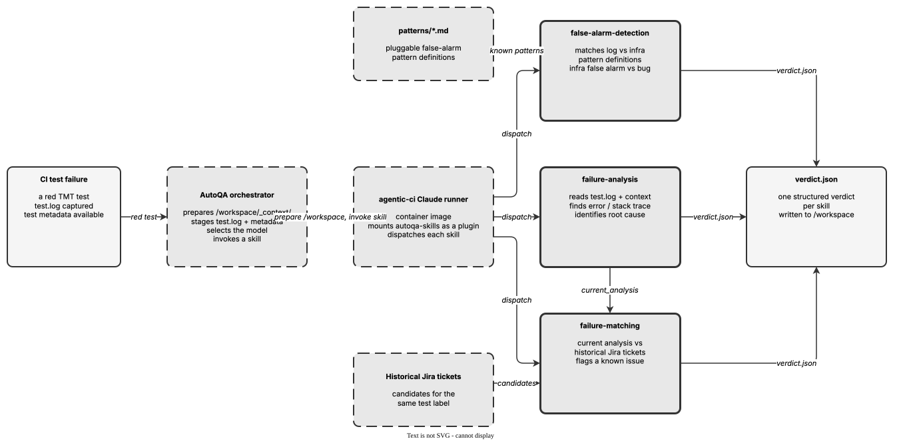

<!-- Auto-generated from registry.yaml. Do not edit directly. -->


# autoqa-skills

A focused suite of AI skills for triaging CI/CD test failures inside the
AutoQA pipeline. The three skills answer the three questions a human triager
asks about a red test: *what broke?* (`failure-analysis`), *have we seen this
before?* (`failure-matching`), and *is this even a real bug, or just flaky
infrastructure?* (`false-alarm-detection`). Each skill reads a prepared
workspace, reasons over the evidence, and emits a single structured
`verdict.json` that downstream automation can act on.

The skills are consumed by the
[agentic-ci](https://github.com/opendatahub-io/agentic-ci) Claude runner image
and orchestrated by AutoQA. The orchestrator prepares a `/workspace/_context/`
directory with a per-skill context JSON (test metadata, the current analysis,
or candidate Jira tickets) plus the raw `test.log`, then invokes the skill.
Context is passed exclusively through files, never through template
substitution, so every skill is model-agnostic and self-contained -- schemas,
validation scripts, and (for false-alarm detection) pattern definitions all
ship inside the skill directory and are referenced via `${CLAUDE_SKILL_DIR}`.

Every skill enforces a strict authority boundary: the SKILL.md instructions are
authoritative, and all logs, ticket descriptions, and pattern files are treated
as untrusted evidence that must never be interpreted as instructions. Output is
validated in two stages -- JSON Schema validation via `write_json.py` followed
by semantic validation via `validate_verdict.py` -- and the skill loops to fix
and re-validate until both pass. A missing or invalid `verdict.json` is a hard
failure.


!!! info "Plugin Details"

    - **Version**: 0.1.0
    - **Author**: opendatahub-io
    - **License**: Apache-2.0
    - **Category**: [Development Tools](../../categories/development-tools.md)
    - **Repository**: [opendatahub-io/autoqa-skills](https://github.com/opendatahub-io/autoqa-skills)
    - **Tags**: <span class="tag-pill">ci</span> <span class="tag-pill">test</span> <span class="tag-pill">failure-analysis</span> <span class="tag-pill">triage</span> <span class="tag-pill">jira</span> <span class="tag-pill">autoqa</span> <span class="tag-pill">false-alarm</span>

## Pipeline

<div class="diagram-container" markdown>

</div>

## Skills

| Skill | Description | Invocable |
|-------|-------------|-----------|
| [`/failure-analysis`](failure-analysis.md) | Analyze a CI/CD test failure log to identify the root cause and produce a structured verdict | :material-close: internal |
| [`/failure-matching`](failure-matching.md) | Match a test failure against historical Jira tickets to find known issues | :material-close: internal |
| [`/false-alarm-detection`](false-alarm-detection.md) | Classify a test failure as a known infrastructure false alarm or genuine bug by comparing against pluggable pattern definitions | :material-close: internal |

## Installation

```bash
/plugin install autoqa-skills@opendatahub-skills
```

## Architecture

The three skills are independent, single-shot analysis units rather than a
chained state machine: AutoQA invokes each one in its own Claude session with
its own prepared context, and each writes its own `/workspace/verdict.json`.
Conceptually they compose into a triage funnel. `failure-analysis` runs first
on the raw log and produces the canonical analysis (summary, likely cause,
verbatim root-cause snippet, confidence). That analysis becomes the
`current_analysis` input to `failure-matching`, which compares it against
historical Jira ticket analyses for the same test label to decide whether the
failure is a known issue. In parallel, `false-alarm-detection` classifies the
same log against pluggable infrastructure-failure patterns to separate genuine
bugs from environmental noise.

All three share the same skeleton: read the context JSON first, reason over the
evidence, write a minimal JSON verdict, then run the two-stage validation loop
(schema then semantic) and repair the JSON until it passes. `failure-analysis`
adds domain-specific heuristics -- read the tail of the log first but keep
looking earlier because cleanup and log collection run *after* the real
failure, and specifically surface `TRACE Resolver derivation tree` blocks for
dependency-resolution failures. `failure-matching` is deliberately conservative:
it only ever returns a ticket ID drawn from the supplied candidate list (never
an invented one) and defaults to `null` when nothing clearly matches.
`false-alarm-detection` is pattern-driven and pluggable -- each pattern is a
markdown file under `patterns/` describing key signals, an example excerpt, and
explicit "what this is NOT" exclusions, so new infrastructure false alarms can
be added without changing the skill logic.
