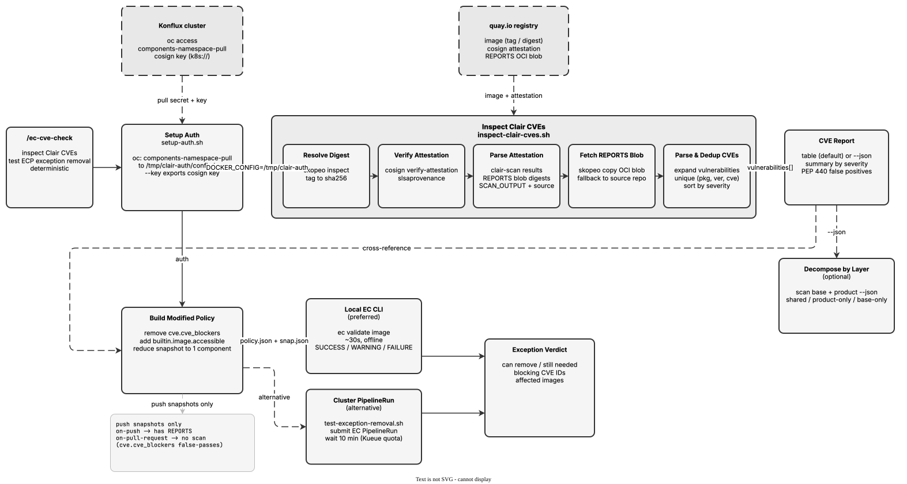

<!-- Auto-generated from registry.yaml. Do not edit directly. -->


# ec-cve-check

Extract the full Clair CVE report from a Konflux-built image's cosign
attestation (the same REPORTS data EC's `cve.cve_blockers` rule evaluates)
and optionally test whether an Enterprise Contract Policy exception can be
removed. Guided and deterministic: it runs bundled bash scripts
(`setup-auth.sh`, `inspect-clair-cves.sh`, `test-exception-removal.sh`)
and an optional local `ec validate` path. Inspection and local validation
are read-only and never modify images, snapshots, or ECP policies; the
alternative cluster PipelineRun path creates a temporary EC PipelineRun on
the cluster to test exception removal.

Produces a severity-sorted CVE table or structured JSON (`image`,
`total_vulnerabilities`, `summary` counts, `vulnerabilities[]`). Supports
diffing a base-image scan against a product-image scan to separate
inherited from product-introduced CVEs, and reports whether an exception is
still needed (with the blocking CVE IDs) when testing removal. Requires
`cosign`, `skopeo`, `python3`, and `oc`; the local exception-removal path
also needs the Conforma `ec` CLI binary and a local clone of
`konflux-release-data`.

**Plugin**: [ec-cve-check](index.md) | **:material-check: User-invocable**

## Contract

<div class="skill-contract">
  <header class="skill-contract__header">
    <span class="skill-contract__eyebrow">Skill Contract</span>
    <span class="skill-contract__version">canonical-skill-v1</span>
  </header>
  <p class="skill-contract__lede">Extract CVE scan results from a Konflux-built container image&#x27;s cosign attestation and optionally test whether an Enterprise Contract Policy exception can be safely removed.</p>
  <section class="skill-contract__section" data-section="01">
    <h3 class="skill-contract__section-title"><span class="skill-contract__section-name">Identity</span></h3>
    <div class="skill-contract__row">
      <span class="skill-contract__field">Functions</span>
      <div class="skill-contract__inline">
        <span class="skill-contract__chip skill-contract__chip--function">analyze</span>
      </div>
    </div>
    <div class="skill-contract__row">
      <span class="skill-contract__field">Success</span>
      <ul class="skill-contract__list">
        <li>Produces a CVE report (table or JSON) from the image&#x27;s Clair REPORTS attestation blob.</li>
        <li>When testing exception removal, reports pass/fail with violation details.</li>
      </ul>
    </div>
  </section>
  <section class="skill-contract__section" data-section="02">
    <h3 class="skill-contract__section-title"><span class="skill-contract__section-name">Optimization Targets</span></h3>
    <div class="skill-contract__metrics">
      <div class="skill-contract__metric">
        <code class="skill-contract__metric-id">task_success</code>
        <span class="skill-contract__measure skill-contract__measure--deterministic">deterministic</span>
        <span class="skill-contract__ref-placeholder"></span>
      </div>
    </div>
  </section>
  <section class="skill-contract__section" data-section="03">
    <h3 class="skill-contract__section-title"><span class="skill-contract__section-name">Invariants</span></h3>
    <div class="skill-contract__row">
      <span class="skill-contract__field">Must Preserve</span>
      <ul class="skill-contract__list">
        <li>Do not modify any cluster resources, images, or policies.</li>
        <li>Do not skip auth setup before scanning.</li>
      </ul>
    </div>
    <div class="skill-contract__row">
      <span class="skill-contract__field">Fixed Context</span>
      <div class="skill-contract__code">
      <div class="skill-contract__code-line"><span class="skill-contract__code-key">tools</span><span class="skill-contract__code-val">Bash, Read</span></div>
      <div class="skill-contract__code-line"><span class="skill-contract__code-key">cli</span><span class="skill-contract__code-val">cosign, skopeo, python3, oc</span></div>
      <div class="skill-contract__code-line"><span class="skill-contract__code-key">knowledge</span><span class="skill-contract__code-val">task_input<span class="skill-contract__privacy">task_private</span></span></div>
      </div>
    </div>
  </section>
  <section class="skill-contract__section" data-section="04">
    <h3 class="skill-contract__section-title"><span class="skill-contract__section-name">Traceability</span></h3>
    <div class="skill-contract__row">
      <span class="skill-contract__field">Skill</span>
      <div class="skill-contract__inline"><a class="skill-contract__path" href="https://github.com/jrusz/ec-cve-check/blob/main/skills/ec-cve-check/SKILL.md"><span class="skill-contract__ref-arrow" aria-hidden="true">↗</span><code>skills/ec-cve-check/SKILL.md</code></a></div>
    </div>
    <div class="skill-contract__row">
      <span class="skill-contract__field">Supporting</span>
      <ul class="skill-contract__paths">
        <li><a class="skill-contract__path" href="https://github.com/jrusz/ec-cve-check/blob/main/skills/ec-cve-check/scripts/setup-auth.sh"><span class="skill-contract__ref-arrow" aria-hidden="true">↗</span><code>skills/ec-cve-check/scripts/setup-auth.sh</code></a></li>
        <li><a class="skill-contract__path" href="https://github.com/jrusz/ec-cve-check/blob/main/skills/ec-cve-check/scripts/inspect-clair-cves.sh"><span class="skill-contract__ref-arrow" aria-hidden="true">↗</span><code>skills/ec-cve-check/scripts/inspect-clair-cves.sh</code></a></li>
        <li><a class="skill-contract__path" href="https://github.com/jrusz/ec-cve-check/blob/main/skills/ec-cve-check/scripts/test-exception-removal.sh"><span class="skill-contract__ref-arrow" aria-hidden="true">↗</span><code>skills/ec-cve-check/scripts/test-exception-removal.sh</code></a></li>
      </ul>
    </div>
  </section>
</div>

## Diagram

<div class="diagram-container" markdown>

</div>

## Usage

```bash
# Guided skill — invoke /ec-cve-check, then it runs the bundled scripts:
# 1. One-time auth per session (pass your Konflux tenant namespace)
bash skills/ec-cve-check/scripts/setup-auth.sh <tenant-namespace>
# 2. Scan an image (tag or digest) — severity-sorted table
DOCKER_CONFIG=/tmp/clair-auth bash skills/ec-cve-check/scripts/inspect-clair-cves.sh <image-ref>
# JSON output for scripting / layer diffing
DOCKER_CONFIG=/tmp/clair-auth bash skills/ec-cve-check/scripts/inspect-clair-cves.sh <image-ref> --json
# Offline: export the cosign key, then pass --key
bash skills/ec-cve-check/scripts/setup-auth.sh <tenant-namespace> --key
# Test ECP exception removal via a cluster PipelineRun (local ec CLI is preferred — see SKILL.md)
bash skills/ec-cve-check/scripts/test-exception-removal.sh <tenant-namespace> <ecp-policy.yaml> <snapshot-name>
```
