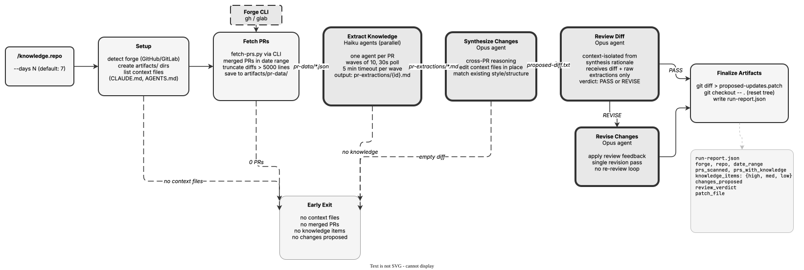

<!-- Auto-generated from registry.yaml. Do not edit directly. -->


# knowledge-repo

Scan merged PRs from the last N days, extract knowledge relevant to AI
agent context, and propose updates to context files (CLAUDE.md, AGENTS.md)
as a git-apply-able patch. Runs a 7-phase pipeline: setup (forge detection,
context file discovery), fetch (PR data via CLI), extract (parallel haiku
agents per PR), synthesize (opus agent merges findings into proposed edits),
review (adversarial opus agent checks quality), revise (conditional fix pass),
and artifacts (patch file, run report). Non-interactive — designed for CI.

**Plugin**: [knowledge-skills](index.md) | **:material-check: User-invocable**

## Contract

<div class="skill-contract">
  <header class="skill-contract__header">
    <span class="skill-contract__eyebrow">Skill Contract</span>
    <span class="skill-contract__version">canonical-skill-v1</span>
  </header>
  <p class="skill-contract__lede">Scan merged pull requests from the last N days, extract the knowledge that belongs in a repository&#x27;s AI context and skill files, and propose the updates as a git-apply-able patch for a human to review.</p>
  <section class="skill-contract__section" data-section="01">
    <h3 class="skill-contract__section-title"><span class="skill-contract__section-name">Identity</span></h3>
    <div class="skill-contract__row">
      <span class="skill-contract__field">Functions</span>
      <div class="skill-contract__inline">
        <span class="skill-contract__chip skill-contract__chip--function">orchestrate</span>
        <span class="skill-contract__chip skill-contract__chip--function">generate</span>
      </div>
    </div>
    <div class="skill-contract__row">
      <span class="skill-contract__field">Success</span>
      <ul class="skill-contract__list">
        <li>Runs the seven phases in order (setup, verify PR data, extract, synthesize, review, conditional revise, artifacts), taking the documented early exit at each gate.</li>
        <li>Dispatches one extraction agent per PR in background waves of at most ten, polling for extraction files and continuing past per-wave timeouts.</li>
        <li>Writes artifacts/proposed-updates.patch and an artifacts/run-report.json carrying forge, repo, date_range, PR and knowledge-item counts, changes_proposed, review_verdict, and patch_file.</li>
        <li>Runs the revise phase only when the review verdict is REVISE, and skips it on PASS.</li>
      </ul>
    </div>
  </section>
  <section class="skill-contract__section" data-section="02">
    <h3 class="skill-contract__section-title"><span class="skill-contract__section-name">Optimization Targets</span></h3>
    <div class="skill-contract__metrics">
      <div class="skill-contract__metric">
        <code class="skill-contract__metric-id">task_success</code>
        <span class="skill-contract__measure skill-contract__measure--judge">judge</span>
        <a class="skill-contract__ref" href="https://github.com/opendatahub-io/knowledge-skills/blob/ba455996269f3fc811e5d3cf3e97422c5516c631/skills/knowledge-repo/prompts/review-agent.md" title="opendatahub-io/knowledge-skills@ba455996269f3fc811e5d3cf3e97422c5516c631:skills/knowledge-repo/prompts/review-agent.md">review-agent.md @ ba45599<span class="skill-contract__ref-arrow" aria-hidden="true">&#x2192;</span></a>
      </div>
    </div>
  </section>
  <section class="skill-contract__section" data-section="03">
    <h3 class="skill-contract__section-title"><span class="skill-contract__section-name">Invariants</span></h3>
    <div class="skill-contract__row">
      <span class="skill-contract__field">Must Preserve</span>
      <ul class="skill-contract__list">
        <li>Resets the working tree with git checkout after capturing the patch, so the run leaves no tracked file modified.</li>
        <li>Never creates a PR or MR; external tooling owns all forge interactions.</li>
        <li>Stops with the documented early-exit run report instead of proceeding when there are no context files, no PRs, no knowledge items, or no changes.</li>
        <li>Keeps the review agent context-isolated from the synthesis agent so the review sees only the diff and the raw extractions.</li>
        <li>Stays non-interactive - the skill is designed to run unattended in CI.</li>
      </ul>
    </div>
    <div class="skill-contract__row">
      <span class="skill-contract__field">Fixed Context</span>
      <div class="skill-contract__code">
      <div class="skill-contract__code-line"><span class="skill-contract__code-key">tools</span><span class="skill-contract__code-val">Bash, Read, Write, Agent, Glob</span></div>
      <div class="skill-contract__code-line"><span class="skill-contract__code-key">knowledge</span><span class="skill-contract__code-val">repository_content<span class="skill-contract__privacy">repository_internal</span>, task_input<span class="skill-contract__privacy">task_private</span>, tool_output<span class="skill-contract__privacy">task_private</span></span></div>
      </div>
    </div>
  </section>
  <section class="skill-contract__section" data-section="04">
    <h3 class="skill-contract__section-title"><span class="skill-contract__section-name">Traceability</span></h3>
    <div class="skill-contract__row">
      <span class="skill-contract__field">Skill</span>
      <div class="skill-contract__inline"><a class="skill-contract__path" href="https://github.com/opendatahub-io/knowledge-skills/blob/ba455996269f3fc811e5d3cf3e97422c5516c631/skills/knowledge-repo/SKILL.md"><span class="skill-contract__ref-arrow" aria-hidden="true">&#x2197;</span><code>skills/knowledge-repo/SKILL.md</code></a></div>
    </div>
    <div class="skill-contract__row">
      <span class="skill-contract__field">Supporting</span>
      <ul class="skill-contract__paths">
        <li><a class="skill-contract__path" href="https://github.com/opendatahub-io/knowledge-skills/blob/ba455996269f3fc811e5d3cf3e97422c5516c631/skills/knowledge-repo/prompts/extract-agent.md"><span class="skill-contract__ref-arrow" aria-hidden="true">&#x2197;</span><code>skills/knowledge-repo/prompts/extract-agent.md</code></a></li>
        <li><a class="skill-contract__path" href="https://github.com/opendatahub-io/knowledge-skills/blob/ba455996269f3fc811e5d3cf3e97422c5516c631/skills/knowledge-repo/prompts/synthesize-agent.md"><span class="skill-contract__ref-arrow" aria-hidden="true">&#x2197;</span><code>skills/knowledge-repo/prompts/synthesize-agent.md</code></a></li>
        <li><a class="skill-contract__path" href="https://github.com/opendatahub-io/knowledge-skills/blob/ba455996269f3fc811e5d3cf3e97422c5516c631/skills/knowledge-repo/prompts/review-agent.md"><span class="skill-contract__ref-arrow" aria-hidden="true">&#x2197;</span><code>skills/knowledge-repo/prompts/review-agent.md</code></a></li>
        <li><a class="skill-contract__path" href="https://github.com/opendatahub-io/knowledge-skills/blob/ba455996269f3fc811e5d3cf3e97422c5516c631/skills/knowledge-repo/prompts/revise-agent.md"><span class="skill-contract__ref-arrow" aria-hidden="true">&#x2197;</span><code>skills/knowledge-repo/prompts/revise-agent.md</code></a></li>
        <li><a class="skill-contract__path" href="https://github.com/opendatahub-io/knowledge-skills/blob/ba455996269f3fc811e5d3cf3e97422c5516c631/skills/knowledge-repo/scripts/list-context-files.sh"><span class="skill-contract__ref-arrow" aria-hidden="true">&#x2197;</span><code>skills/knowledge-repo/scripts/list-context-files.sh</code></a></li>
      </ul>
    </div>
  </section>
</div>

## Diagram

<div class="diagram-container" markdown>

</div>

## Arguments

```bash
/knowledge-repo [--days N]
```

| Argument | Required | Default | Description |
|----------|----------|---------|-------------|
| `--days` |  | `7` | How far back to scan merged PRs |

## Usage

```bash
/knowledge-repo
/knowledge-repo --days 14
/knowledge-repo --days 30
```
