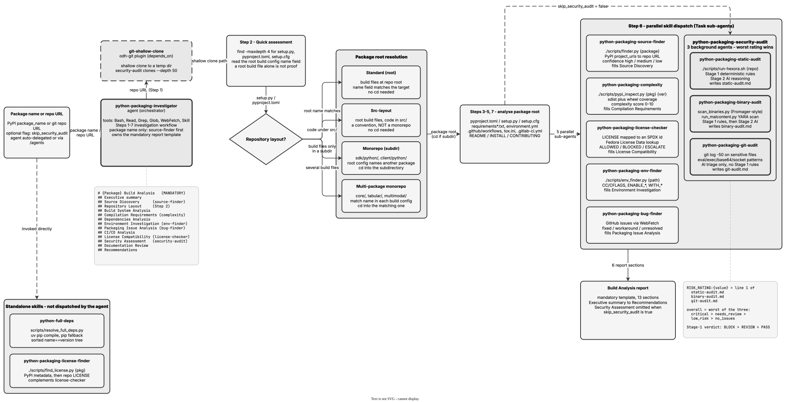

<!-- Auto-generated from registry.yaml. Do not edit directly. -->


# odh-python-packaging

A toolchain for answering the question "can we build this Python package from
source, and is it safe to ship?" — the analysis that has to happen before a
package enters a Red Hat wheel build. Eleven skills cover two concerns.

**Build feasibility.** Locate the upstream repository from PyPI metadata and
project URLs (`source-finder`), score how hard the package is to compile
(`complexity`), resolve the full install-time transitive dependency tree
(`full-deps`), discover the environment variables that customize a wheel build
(`env-finder`), determine the license from PyPI and then from the repository
itself and check it against Fedora License Data for redistribution rights
(`license-finder`, `license-checker`), and surface known packaging bugs and
their workarounds from the project's GitHub issues (`bug-finder`).

**Supply-chain security.** `security-audit` fans out to three scanners —
`static-audit` (hexora static analysis), `binary-audit` (Fromager-style
compiled-artifact detection plus malcontent YARA rules), and `git-audit`
(recent commits touching packaging-sensitive files) — and combines their
verdicts into a single risk rating.

The `python-packaging-investigator` agent ties it together: it detects the
repository layout (including monorepos where the package lives in a
subdirectory), then dispatches six of the skills as parallel sub-agents and
renders the results into a mandatory build-analysis report template, so every
investigation produces the same sections in the same order.


!!! info "Plugin Details"

    - **Version**: 0.1.0
    - **Author**: opendatahub-io
    - **License**: Apache-2.0
    - **Scope**: Generic
    - **Category**: [Development Tools](../../categories/development-tools.md)
    - **Repository**: [opendatahub-io/ai-helpers/plugins/odh-python-packaging](https://github.com/opendatahub-io/ai-helpers/tree/main/plugins/odh-python-packaging)
    - **Tags**: <span class="tag-pill">python-packaging</span> <span class="tag-pill">licensing</span> <span class="tag-pill">dependencies</span> <span class="tag-pill">security-audit</span>

## Pipeline

<div class="diagram-container" markdown>

</div>

## Dependencies

- [`odh-git`](../odh-git/index.md)

## Skills

| Skill | Description | Invocable |
|-------|-------------|-----------|
| [`/python-full-deps`](python-full-deps.md) | Resolve the full install-time dependency tree for a Python package. Use when the user needs all transitive dependencies, full dependency list, or install requirements resolved for a specific Python version with environment markers. | :material-check: |
| [`/python-packaging-binary-audit`](python-packaging-binary-audit.md) | Scan a Python package repository for compiled/binary files using Fromager-style detection and malcontent YARA analysis, then triage findings with deterministic rules and AI reasoning to produce a structured risk report section. | :material-check: |
| [`/python-packaging-bug-finder`](python-packaging-bug-finder.md) | Use when you need to find known packaging bugs, fixes, and workarounds for Python projects by searching GitHub issues and analyzing their resolution status | :material-check: |
| [`/python-packaging-complexity`](python-packaging-complexity.md) | Use this skill to analyze Python package build complexity by inspecting PyPI metadata. Evaluates compilation requirements, dependencies, distribution types, and provides recommendations for wheel building strategies. | :material-check: |
| [`/python-packaging-env-finder`](python-packaging-env-finder.md) | Use this skill to investigate environment variables that can be set when building Python wheels for a given project. Analyzes setup.py, CMake files, and other build configuration files to discover customizable build environment variables. | :material-check: |
| [`/python-packaging-git-audit`](python-packaging-git-audit.md) | Inspect recent git history of a Python package repository for suspicious commits touching supply-chain-sensitive files, then triage findings with AI reasoning to produce a structured risk report section. | :material-check: |
| [`/python-packaging-license-checker`](python-packaging-license-checker.md) | Use this skill to check whether a Python package license is compatible with redistribution in Red Hat products, using the Fedora License Data as the authoritative policy source. Produces a structured six-field verdict with escalation guidance for non-trivial cases. | :material-check: |
| [`/python-packaging-license-finder`](python-packaging-license-finder.md) | Use this skill to deterministically find license information for Python packages by checking PyPI metadata first, then falling back to Git repository LICENSE files using shallow cloning. | :material-check: |
| [`/python-packaging-security-audit`](python-packaging-security-audit.md) | Use this skill to evaluate the security of a Python package repository by orchestrating static analysis, binary scanning, and git history inspection sub-skills in parallel, then combining their results into a unified security report with a risk rating. | :material-check: |
| [`/python-packaging-source-finder`](python-packaging-source-finder.md) | Use this skill to locate source code repositories for Python packages by analyzing PyPI metadata, project URLs, and code hosting platforms like GitHub, GitLab, and Bitbucket. Provides deterministic results with confidence levels. | :material-check: |
| [`/python-packaging-static-audit`](python-packaging-static-audit.md) | Run hexora static analysis on a Python package repository to detect suspicious code patterns, then triage findings with deterministic rules and AI reasoning to produce a structured risk report section. | :material-check: |

## Agents

| Agent | Description |
|-------|-------------|
| python-packaging-investigator | Investigates Python package repositories to analyze build systems, dependencies, and packaging complexity. Provides comprehensive guidance on how packages can be built from source using integrated analysis skills. |

## Installation

**Claude Code**

```bash
/plugin install odh-python-packaging@opendatahub-skills
```

**OpenAI Codex** — add the marketplace, then enable `odh-python-packaging` from the `/plugins` browser:

```bash
codex plugin marketplace add opendatahub-io/skills-registry
```

## Architecture

**Two-level parallel fan-out.** The investigator agent dispatches
`source-finder`, `complexity`, `license-checker`, `env-finder`, `bug-finder`
and `security-audit` as concurrent sub-agents; `security-audit` in turn
dispatches `static-audit`, `binary-audit` and `git-audit`. Each leaf writes
into its own section of the report template, so the depth is invisible to the
caller. The agent's `skip_security_audit` flag prunes the whole second level
when a pipeline has already run the audit as an earlier stage.

**Deterministic first, AI second.** `static-audit` and `binary-audit` triage
in two stages: Stage 1 applies deterministic rules, and only findings it does
not resolve reach Stage 2 for AI reasoning. That keeps the expensive,
non-reproducible step scoped to genuinely ambiguous cases. `git-audit` is the
exception and says so — a commit needs contextual judgement about author,
intent and scope, so there is no Stage 1 for it. All three land in the same
fixed buckets (critical / suspicious / likely legitimate), and
`security-audit` combines them worst-rating-wins into one risk rating
(`critical` > `needs_review` > `low_risk` > `no_issues`).

**CI mode and standalone mode.** `static-audit` and `binary-audit` accept
pre-computed scanner results when a pipeline has already produced them, and
otherwise run the scanner locally. The same skill therefore serves both an
interactive investigation and an automated build gate without a separate
code path.

**Script-wrapping.** Most skills are thin wrappers over a helper script under
the skill's own `scripts/` directory, so the deterministic part is testable
and reproducible outside an agent; the SKILL.md contributes the interpretation
and the report shape rather than the computation.

**Cross-plugin dependency.** Skills that need a working tree (the license
checker, the audits, the investigator agent) clone through `git-shallow-clone`
from `odh-git` — the registry entry records this with `depends_on: [odh-git]`,
the only cross-plugin edge the ai-helpers split created.
