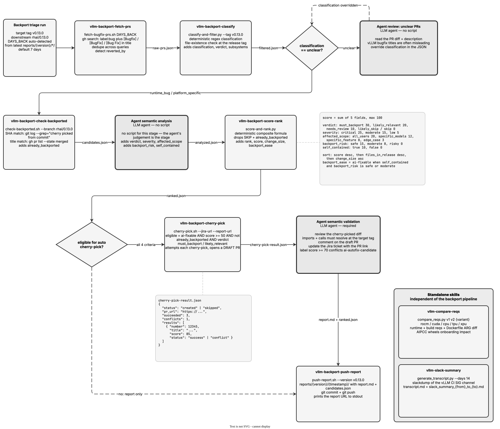

<!-- Auto-generated from registry.yaml. Do not edit directly. -->


# odh-vllm

Tooling for keeping a downstream vLLM release branch current with upstream
bugfixes. Six of the eight skills form a backport triage pipeline: fetch
merged bugfix PRs from `vllm-project/vllm` over a date window, classify and
filter them against a release tag, detect which are already cherry-picked
downstream, score and rank what remains, attempt automatic cherry-picks for
the safe candidates, and publish a timestamped triage report.

The remaining two stand alone. `vllm-compare-reqs` diffs vLLM requirements
files between two versions and reports the impact on wheel builds;
`vllm-slack-summary` summarizes vLLM CI SIG Slack channel activity for the
RHAIIS midstream release team.

The pipeline is designed to be re-run on a cadence: each run auto-detects how
far back to look from the last report directory, so successive runs pick up
where the previous one stopped rather than re-triaging the same PRs.


!!! info "Plugin Details"

    - **Version**: 0.1.0
    - **Author**: opendatahub-io
    - **License**: Apache-2.0
    - **Category**: [DevOps & CI/CD](../../categories/devops.md)
    - **Repository**: [opendatahub-io/ai-helpers/plugins/odh-vllm](https://github.com/opendatahub-io/ai-helpers/tree/main/plugins/odh-vllm)
    - **Tags**: <span class="tag-pill">vllm</span> <span class="tag-pill">backport</span> <span class="tag-pill">release</span>

## Pipeline

<div class="diagram-container" markdown>

</div>

## Skills

| Skill | Description | Invocable |
|-------|-------------|-----------|
| [`/vllm-backport-check-backported`](vllm-backport-check-backported.md) | Check which candidate PRs have already been cherry-picked into the downstream branch. Use after classify-and-filter to mark already_backported on each PR. Fully deterministic — compares merge SHAs and PR titles. | :material-check: |
| [`/vllm-backport-cherry-pick`](vllm-backport-cherry-pick.md) | Auto cherry-pick backport candidates and create a draft PR on the downstream repo. Use after scoring to attempt clean cherry-picks for ai-fixable candidates. The agent must still do semantic validation on the result. | :material-check: |
| [`/vllm-backport-classify`](vllm-backport-classify.md) | Classify bugfix PRs by type (runtime_bug, platform_specific, unclear, not_bugfix) and filter by file existence at a release tag. Use after fetching raw PRs to produce a filtered candidate list. PRs marked "unclear" need agent review. | :material-check: |
| [`/vllm-backport-fetch-prs`](vllm-backport-fetch-prs.md) | Fetch merged bugfix PRs from vllm-project/vllm within a date window. Use when starting a backport triage run to get raw PR data from GitHub. Outputs a JSON array of PR objects with labels, authors, and merge commits. | :material-check: |
| [`/vllm-backport-push-report`](vllm-backport-push-report.md) | Push a triage report to GitHub under a timestamped directory in reports/. Use after the agent writes the report markdown and has ranked.json ready. Outputs the report URL to stdout. | :material-check: |
| [`/vllm-backport-score-rank`](vllm-backport-score-rank.md) | Score and rank backport candidates using a composite formula based on verdict, severity, scope, risk, and self-containedness. Use after the agent completes semantic analysis to produce a prioritized ranked list. | :material-check: |
| [`/vllm-compare-reqs`](vllm-compare-reqs.md) | Use this skill to compare vllm requirements files between versions | :material-check: |
| [`/vllm-slack-summary`](vllm-slack-summary.md) | Use this skill to generate slack summaries of vLLM CI SIG Slack channel activity for the RHAIIS midstream release team | :material-check: |

## Installation

**Claude Code**

```bash
/plugin install odh-vllm@opendatahub-skills
```

**OpenAI Codex** — add the marketplace, then enable `odh-vllm` from the `/plugins` browser:

```bash
codex plugin marketplace add opendatahub-io/skills-registry
```

## Architecture

**A JSON artifact pipeline.** Each stage reads the previous stage's file from
`artifacts/backport-triage/` and writes the next, so any stage can be re-run
or inspected in isolation:

`raw-prs.json` → `filtered.json` → `candidates.json` → `analyzed.json` →
`ranked.json` → `cherry-pick-result.json`

**Deterministic stages with agent checkpoints between them.** `fetch-prs`,
`check-backported`, `score-rank` and `push-report` are fully deterministic
shell and Python. Two points deliberately hand back to the agent: `classify`
marks PRs it cannot decide as `unclear` for the agent to review against the
actual diff (vLLM bugfix titles are often misleading), and that review is what
turns `candidates.json` into the `analyzed.json` that `score-rank` consumes.
There is no script that produces `analyzed.json` — the semantic judgement is
the stage.

**Scoring is a fixed formula, not a judgement.** `score-rank` sums verdict
(≤30), severity (≤25), affected scope (≤20), backport risk (≤15) and
self-containedness (≤10) to a maximum of 100, then sorts by score, files
present in the release, and change size. Making the ranking reproducible is
the point: the same `analyzed.json` always ranks identically, so a run can be
audited after the fact.

**A gate before automation.** `cherry-pick` only attempts a PR that is
`ai-fixable`, scores ≥ 50, is not already backported, and carries a
`must_backport` or `likely_relevant` verdict. It opens a *draft* PR, and the
skill requires the agent to follow up with semantic validation — checking that
the cherry-picked diff does not import modules or call functions that do not
exist at the target tag, which a clean `git cherry-pick` will not catch.
