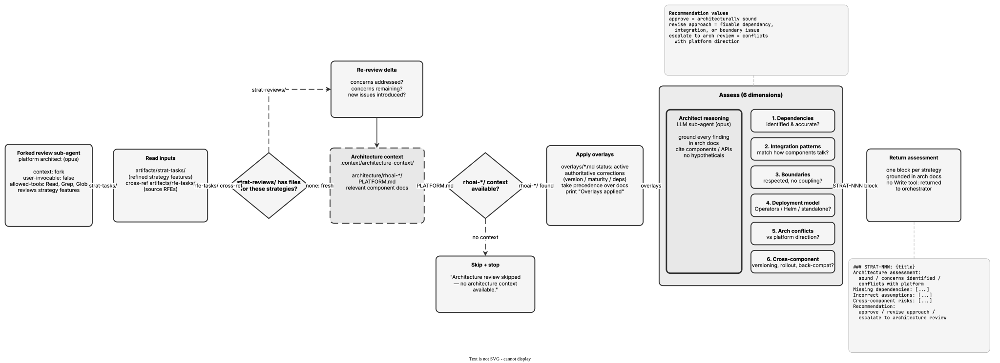

<!-- Auto-generated from registry.yaml. Do not edit directly. -->


# architecture-review

Internal forked reviewer sub-agent (context: fork, model: opus) for the
strategy workflow. Acts as a platform architect assessing refined strategy
features in artifacts/strat-tasks/ (cross-referenced against source RFEs)
for architectural correctness: verifies every dependency against the
architecture docs, checks integration patterns match how components actually
communicate, ensures component boundaries aren't violated, validates the
deployment model, and flags architectural conflicts and cross-component
coordination needs (versioning, rollout order, backwards compatibility).
Applies architecture-context overlays as authoritative corrections, skips
cleanly when no architecture context is available, and grounds every
finding in specific docs, components, or APIs.

**Plugin**: [rfe-creator](index.md) | **:material-close: Internal**

## Contract

<div class="skill-contract">
  <header class="skill-contract__header">
    <span class="skill-contract__eyebrow">Skill Contract</span>
    <span class="skill-contract__version">canonical-skill-v1</span>
  </header>
  <p class="skill-contract__lede">Review strategy features for architectural correctness — dependencies, integration patterns, and component interactions.</p>
  <section class="skill-contract__section" data-section="01">
    <h3 class="skill-contract__section-title"><span class="skill-contract__section-name">Identity</span></h3>
    <div class="skill-contract__row">
      <span class="skill-contract__field">Functions</span>
      <div class="skill-contract__inline">
        <span class="skill-contract__chip skill-contract__chip--function">review</span>
      </div>
    </div>
    <div class="skill-contract__row">
      <span class="skill-contract__field">Success</span>
      <ul class="skill-contract__list">
        <li>Produces an architecture assessment for each strategy with a recommendation.</li>
        <li>Grounds every finding in architecture docs with specific component and API citations.</li>
      </ul>
    </div>
  </section>
  <section class="skill-contract__section" data-section="02">
    <h3 class="skill-contract__section-title"><span class="skill-contract__section-name">Optimization Targets</span></h3>
    <div class="skill-contract__metrics">
      <div class="skill-contract__metric">
        <code class="skill-contract__metric-id">task_success</code>
        <span class="skill-contract__measure skill-contract__measure--judge">judge</span>
        <a class="skill-contract__ref" href="https://github.com/opendatahub-io/rfe-creator/blob/c8a2a1edb53654f08bbe67b7aa4382121e22866f/.claude/skills/architecture-review/SKILL.md" title="opendatahub-io/rfe-creator@c8a2a1edb53654f08bbe67b7aa4382121e22866f:.claude/skills/architecture-review/SKILL.md">SKILL.md @ c8a2a1e<span class="skill-contract__ref-arrow" aria-hidden="true">&#x2192;</span></a>
      </div>
    </div>
  </section>
  <section class="skill-contract__section" data-section="03">
    <h3 class="skill-contract__section-title"><span class="skill-contract__section-name">Invariants</span></h3>
    <div class="skill-contract__row">
      <span class="skill-contract__field">Must Preserve</span>
      <ul class="skill-contract__list">
        <li>Do not approve strategies with incorrect dependency assumptions.</li>
        <li>Do not flag concerns without citing specific architecture documentation.</li>
      </ul>
    </div>
    <div class="skill-contract__row">
      <span class="skill-contract__field">Fixed Context</span>
      <div class="skill-contract__code">
      <div class="skill-contract__code-line"><span class="skill-contract__code-key">tools</span><span class="skill-contract__code-val">Read, Grep, Glob</span></div>
      <div class="skill-contract__code-line"><span class="skill-contract__code-key">knowledge</span><span class="skill-contract__code-val">repository_content<span class="skill-contract__privacy">public</span>, task_input<span class="skill-contract__privacy">task_private</span></span></div>
      </div>
    </div>
  </section>
  <section class="skill-contract__section" data-section="04">
    <h3 class="skill-contract__section-title"><span class="skill-contract__section-name">Traceability</span></h3>
    <div class="skill-contract__row">
      <span class="skill-contract__field">Skill</span>
      <div class="skill-contract__inline"><a class="skill-contract__path" href="https://github.com/opendatahub-io/rfe-creator/blob/c8a2a1edb53654f08bbe67b7aa4382121e22866f/.claude/skills/architecture-review/SKILL.md"><span class="skill-contract__ref-arrow" aria-hidden="true">&#x2197;</span><code>.claude/skills/architecture-review/SKILL.md</code></a></div>
    </div>
  </section>
</div>

## Diagram

<div class="diagram-container" markdown>

</div>

## Usage

```bash
/architecture-review
```
