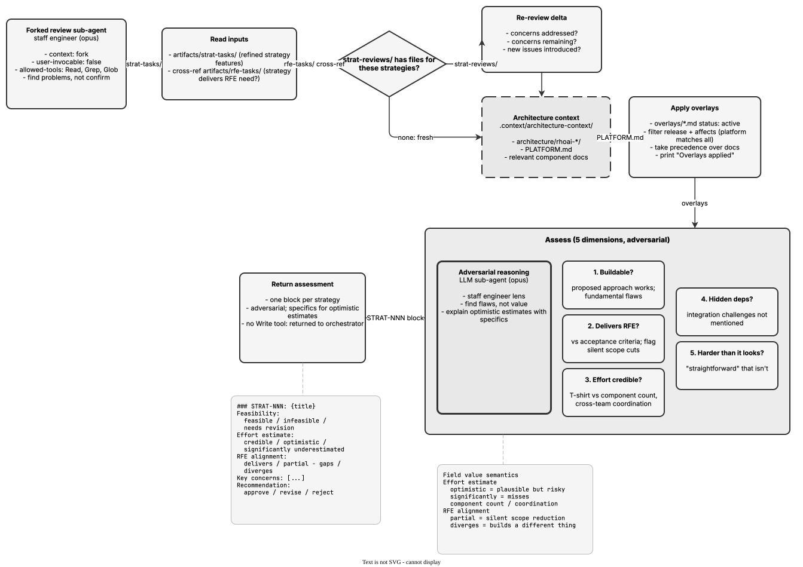

<!-- Auto-generated from registry.yaml. Do not edit directly. -->


# feasibility-review

Internal forked reviewer sub-agent (context: fork, model: opus) for the
strategy workflow. Acts as a staff engineer assessing refined strategy
features in artifacts/strat-tasks/ for technical feasibility: whether the
proposed approach actually works, whether it delivers what the source RFE
asks for (flagging silent scope reduction), whether the effort estimate /
T-shirt size is credible, and what hidden dependencies or integration
challenges will surface during implementation. Grounds assessments in
architecture context and overlays, takes an adversarial stance toward
optimistic estimates, and emits an approve / revise / reject recommendation.

**Plugin**: [rfe-creator](index.md) | **:material-check: User-invocable**

## Diagram

<div class="diagram-container" markdown>

</div>

## Usage

```bash
/feasibility-review
```
