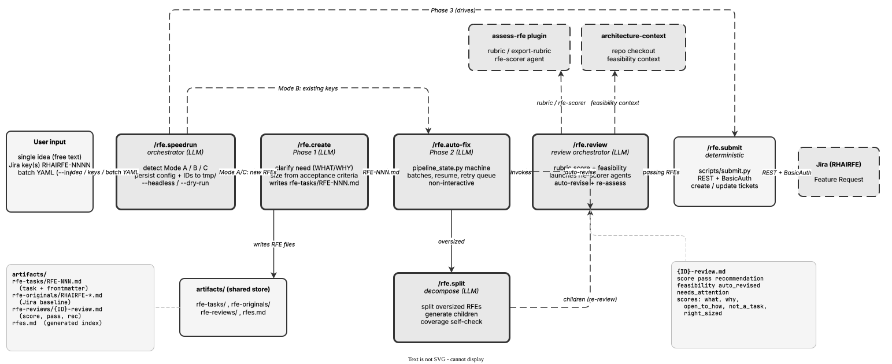

<!-- Auto-generated from registry.yaml. Do not edit directly. -->


# rfe-creator

A comprehensive Claude Code skill suite for the full lifecycle of Requests for
Enhancement (RFEs) in the RHAIRFE Jira project. Covers creation from problem
statements, multi-phase rubric-based review with technical feasibility checks
and auto-revision, intelligent splitting of oversized RFEs, batch auto-fix at
scale, and deterministic submission to Jira. A speedrun skill chains the whole
pipeline end-to-end (create → auto-fix → submit) for a single idea, a set of
existing Jira keys, or a YAML batch of ideas.

The plugin uses a shared artifact convention -- all skills read from and write
to an `artifacts/` directory, with YAML frontmatter (managed exclusively via
`scripts/frontmatter.py`) carrying structured metadata on every task and review
file. Jira write operations go through deterministic Python scripts (REST API +
Basic Auth) rather than LLM tool-calling, so the exact sequence of API calls is
reproducible; read operations prefer the Atlassian MCP server and fall back to
the REST API. Long-running orchestrators persist state to `tmp/` via
`scripts/state.py` so they survive context-compression boundaries. A dependency
on the `assess-rfe` plugin provides the scoring rubric, bootstrapped
automatically on first use.


!!! info "Plugin Details"

    - **Version**: 0.1.0
    - **Author**: jwforres
    - **Category**: [Product Planning](../../categories/planning.md)
    - **Repository**: [opendatahub-io/rfe-creator](https://github.com/opendatahub-io/rfe-creator)
    - **Tags**: <span class="tag-pill">rfe</span> <span class="tag-pill">jira</span> <span class="tag-pill">review</span> <span class="tag-pill">strategy</span> <span class="tag-pill">pipeline</span>

## Pipeline

<div class="diagram-container" markdown>

</div>

## Dependencies

- [`assess-rfe`](../assess-rfe/index.md)

## Skills

| Skill | Description | Invocable |
|-------|-------------|-----------|
| [`/rfe.create`](rfe.create.md) | Generate new RFEs from problem statements | :material-check: |
| [`/rfe.review`](rfe.review.md) | Score and improve RFEs with auto-revision | :material-check: |
| [`/rfe.split`](rfe.split.md) | Decompose oversized RFEs into appropriately-scoped pieces | :material-check: |
| [`/rfe.submit`](rfe.submit.md) | Push RFEs to Jira | :material-check: |
| [`/rfe.speedrun`](rfe.speedrun.md) | Execute the full RFE pipeline end-to-end | :material-check: |
| [`/rfe.auto-fix`](rfe.auto-fix.md) | Batch review, revise, and split operations | :material-check: |
| [`/rfe-creator.update-deps`](rfe-creator.update-deps.md) | Update vendored dependencies | :material-check: |
| [`/architecture-review`](architecture-review.md) | Architecture review skill | :material-check: |
| [`/feasibility-review`](feasibility-review.md) | Feasibility review skill | :material-check: |
| [`/rfe-feasibility-review`](rfe-feasibility-review.md) | RFE feasibility review | :material-check: |
| [`/scope-review`](scope-review.md) | Scope review skill | :material-check: |
| [`/testability-review`](testability-review.md) | Testability review skill | :material-check: |

## Installation

```bash
/plugin install rfe-creator@opendatahub-skills
```

## Architecture

The RFE skills (rfe.*) form the requirements pipeline. `rfe.speedrun` is the
top-level orchestrator: it invokes `rfe.create`, `rfe.auto-fix`, and
`rfe.submit` as sub-skills and never duplicates their work, persisting the ID
list and flags between phases so the run is resumable.

`rfe.review` is the central review orchestrator and is deliberately
content-blind -- it never reads RFE bodies into its own context. Instead it
launches parallel waves of sub-agents (fetch, assess, feasibility, review,
revise), reads only YAML frontmatter via `scripts/frontmatter.py`, checks file
existence via Glob, and polls for wave completion with
`scripts/check_review_progress.py` (sleeping for the reported `NEXT_POLL`
interval). Rubric assessment is delegated to the `assess-rfe` plugin (a
dedicated `rfe-scorer` subagent), and per-RFE technical feasibility is delegated
to the `rfe-feasibility-review` sub-agent. Failing RFEs are auto-revised and
re-assessed for up to two cycles.

`rfe.auto-fix` wraps the same building blocks into a non-interactive pipeline
state machine (`scripts/pipeline_state.py`) with phased dispatch (fetch →
bootstrap → assess → feasibility → review → revise → re-assess → split). It
drives a strict `next-action` / `launch_wave` / `wait-for-wave` loop, processes
IDs in configurable batches, and supports snapshot-based incremental fetch
(`scripts/snapshot_fetch.py`) for resume and reprocessing. `rfe.split`
decomposes oversized RFEs via parallel split agents, re-reviews the children
through `rfe.review`, and runs a one-cycle right-sizing self-correction loop.

Review artifacts follow a fixed layout under `artifacts/` (`rfe-tasks/`,
`rfe-originals/`, `rfe-reviews/`), and `scripts/frontmatter.py rebuild-index`
regenerates `rfes.md`. Architecture context is fetched from
opendatahub-io/architecture-context into `.context/architecture-context/` and
used by the feasibility fork to ground assessments in real platform components
and APIs; human-authored overlays under `overlays/` take precedence over the
generated docs. Note that `architecture-review`, `feasibility-review`,
`scope-review`, and `testability-review` are forked strategy reviewers (they
read `artifacts/strat-tasks/` and assess refined strategy features) shared with
the strategy workflow; `rfe-feasibility-review` is the RFE-specific reviewer
wired into `rfe.review`.
