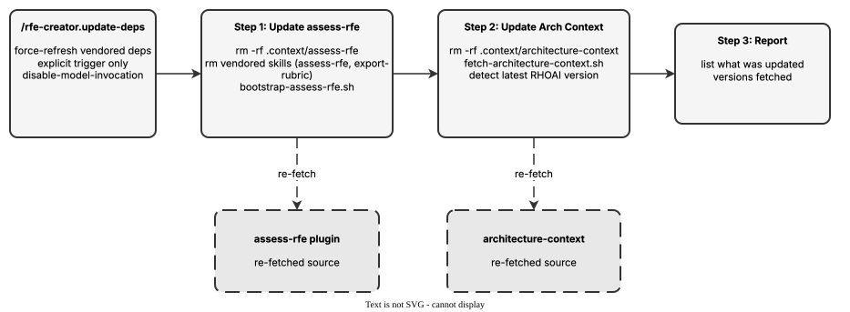

<!-- Auto-generated from registry.yaml. Do not edit directly. -->


# rfe-creator.update-deps

Force-update all vendored dependencies by removing cached copies and
re-fetching. Refreshes the assess-rfe skills (assess-rfe / export-rubric,
via scripts/bootstrap-assess-rfe.sh) and the architecture context (from
opendatahub-io/architecture-context, via scripts/fetch-architecture-context.sh),
then reports what was updated and the versions fetched. Has
disable-model-invocation set, so it can only be triggered explicitly by the
user.

**Plugin**: [rfe-creator](index.md) | **:material-check: User-invocable**

## Contract

<div class="skill-contract">
  <header class="skill-contract__header">
    <span class="skill-contract__eyebrow">Skill Contract</span>
    <span class="skill-contract__version">canonical-skill-v1</span>
  </header>
  <p class="skill-contract__lede">Force-refresh the vendored assess-rfe skills and architecture context to their latest versions.</p>
  <section class="skill-contract__section" data-section="01">
    <h3 class="skill-contract__section-title"><span class="skill-contract__section-name">Identity</span></h3>
    <div class="skill-contract__row">
      <span class="skill-contract__field">Functions</span>
      <div class="skill-contract__inline">
        <span class="skill-contract__chip skill-contract__chip--function">execute</span>
      </div>
    </div>
    <div class="skill-contract__row">
      <span class="skill-contract__field">Success</span>
      <ul class="skill-contract__list">
        <li>Removes the cached assess-rfe and architecture-context copies, then re-fetches the latest.</li>
        <li>Reports what was updated and the versions fetched.</li>
      </ul>
    </div>
  </section>
  <section class="skill-contract__section" data-section="02">
    <h3 class="skill-contract__section-title"><span class="skill-contract__section-name">Optimization Targets</span></h3>
    <div class="skill-contract__metrics">
      <div class="skill-contract__metric">
        <code class="skill-contract__metric-id">task_success</code>
        <span class="skill-contract__measure skill-contract__measure--deterministic">deterministic</span>
        <span class="skill-contract__ref-placeholder"></span>
      </div>
    </div>
  </section>
  <section class="skill-contract__section" data-section="03">
    <h3 class="skill-contract__section-title"><span class="skill-contract__section-name">Invariants</span></h3>
    <div class="skill-contract__row">
      <span class="skill-contract__field">Must Preserve</span>
      <ul class="skill-contract__list">
        <li>Only run when explicitly invoked (disable-model-invocation is set).</li>
        <li>Re-fetch after removing caches — do not leave dependencies partially removed.</li>
      </ul>
    </div>
    <div class="skill-contract__row">
      <span class="skill-contract__field">Fixed Context</span>
      <div class="skill-contract__code">
      <div class="skill-contract__code-line"><span class="skill-contract__code-key">tools</span><span class="skill-contract__code-val">Bash, Glob</span></div>
      <div class="skill-contract__code-line"><span class="skill-contract__code-key">cli</span><span class="skill-contract__code-val">bash</span></div>
      <div class="skill-contract__code-line"><span class="skill-contract__code-key">knowledge</span><span class="skill-contract__code-val">repository_content<span class="skill-contract__privacy">public</span>, tool_output<span class="skill-contract__privacy">task_private</span></span></div>
      </div>
    </div>
  </section>
  <section class="skill-contract__section" data-section="04">
    <h3 class="skill-contract__section-title"><span class="skill-contract__section-name">Traceability</span></h3>
    <div class="skill-contract__row">
      <span class="skill-contract__field">Skill</span>
      <div class="skill-contract__inline"><a class="skill-contract__path" href="https://github.com/opendatahub-io/rfe-creator/blob/main/.claude/skills/rfe-creator.update-deps/SKILL.md"><span class="skill-contract__ref-arrow" aria-hidden="true">&#x2197;</span><code>.claude/skills/rfe-creator.update-deps/SKILL.md</code></a></div>
    </div>
  </section>
</div>

## Diagram

<div class="diagram-container" markdown>

</div>

## Usage

```bash
/rfe-creator.update-deps
```
