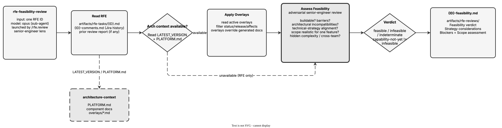

<!-- Auto-generated from registry.yaml. Do not edit directly. -->


# rfe-feasibility-review

Internal sub-agent (model: opus) launched per RFE by rfe.review. Acts as a
senior engineer looking for blockers and risks rather than confirming the
work is good. Reads the RFE task file (and Jira comment history if present),
grounds its assessment in architecture context (LATEST_VERSION / PLATFORM.md
plus active overlays filtered by status, release, and affected components),
and reads any prior review report for re-reviews. Emits one of three
verdicts -- feasible (can be built), infeasible (platform architecture
fundamentally conflicts), or indeterminate (RFE too ambiguous to assess) --
distinguishing "capability doesn't exist yet" (feasible) from
"architecturally incompatible" (infeasible). Named components absent from
the architecture inventory are treated as strategy considerations, not
blockers. Writes to artifacts/rfe-reviews/{ID}-feasibility.md.

**Plugin**: [rfe-creator](index.md) | **:material-check: User-invocable**

## Diagram

<div class="diagram-container" markdown>

</div>

## Usage

```bash
/rfe-feasibility-review
```
