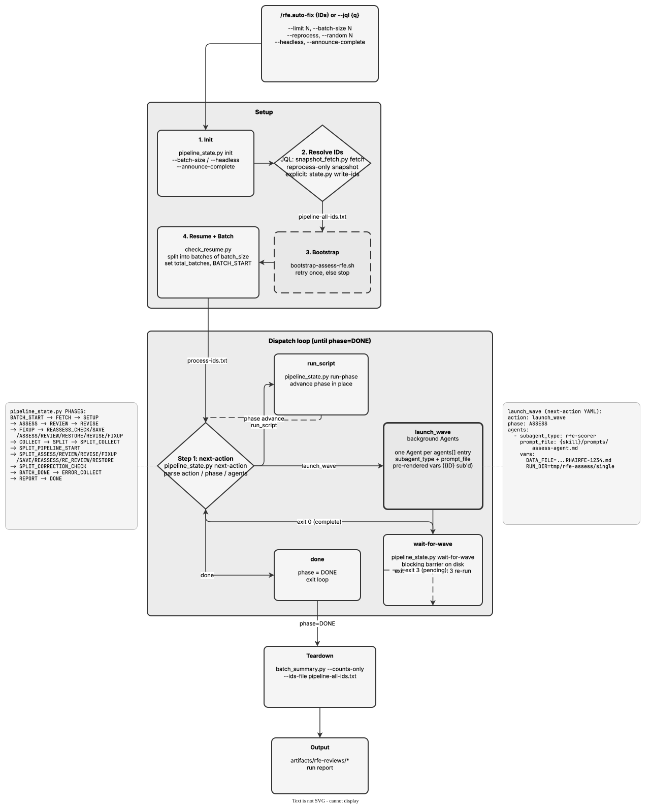

<!-- Auto-generated from registry.yaml. Do not edit directly. -->


# rfe.auto-fix

Non-interactive batch pipeline for reviewing, revising, and splitting RFEs
at scale. Accepts explicit IDs or a JQL query (with --limit and --random
sampling) to fetch from Jira. Runs a pipeline state machine
(pipeline_state.py) with phased dispatch -- fetch, bootstrap, assess,
feasibility, review, revise, re-assess, and split -- driven by a strict
next-action / launch_wave / wait-for-wave loop that must run to completion
(no early exit, context compression handled automatically). Processes IDs in
configurable batches with snapshot-based incremental fetch
(snapshot_fetch.py) for resume and --reprocess support, then emits a run
report and counts summary.

**Plugin**: [rfe-creator](index.md) | **:material-check: User-invocable**

## Contract

<div class="skill-contract">
  <header class="skill-contract__header">
    <span class="skill-contract__eyebrow">Skill Contract</span>
    <span class="skill-contract__version">canonical-skill-v1</span>
  </header>
  <p class="skill-contract__lede">Review, revise, and split batches of RFEs non-interactively through a pipeline state machine.</p>
  <section class="skill-contract__section" data-section="01">
    <h3 class="skill-contract__section-title"><span class="skill-contract__section-name">Identity</span></h3>
    <div class="skill-contract__row">
      <span class="skill-contract__field">Functions</span>
      <div class="skill-contract__inline">
        <span class="skill-contract__chip skill-contract__chip--function">orchestrate</span>
      </div>
    </div>
    <div class="skill-contract__row">
      <span class="skill-contract__field">Success</span>
      <ul class="skill-contract__list">
        <li>Processes every ID through assess, feasibility, review, revise, re-assess, and split phases until DONE.</li>
        <li>Emits a run report and a counts summary.</li>
      </ul>
    </div>
  </section>
  <section class="skill-contract__section" data-section="02">
    <h3 class="skill-contract__section-title"><span class="skill-contract__section-name">Optimization Targets</span></h3>
    <div class="skill-contract__metrics">
      <div class="skill-contract__metric">
        <code class="skill-contract__metric-id">task_success</code>
        <span class="skill-contract__measure skill-contract__measure--judge">judge</span>
        <a class="skill-contract__ref" href="https://github.com/opendatahub-io/rfe-creator/blob/c8a2a1edb53654f08bbe67b7aa4382121e22866f/.claude/skills/rfe.auto-fix/SKILL.md" title="opendatahub-io/rfe-creator@c8a2a1edb53654f08bbe67b7aa4382121e22866f:.claude/skills/rfe.auto-fix/SKILL.md">SKILL.md @ c8a2a1e<span class="skill-contract__ref-arrow" aria-hidden="true">&#x2192;</span></a>
      </div>
    </div>
  </section>
  <section class="skill-contract__section" data-section="03">
    <h3 class="skill-contract__section-title"><span class="skill-contract__section-name">Invariants</span></h3>
    <div class="skill-contract__row">
      <span class="skill-contract__field">Must Preserve</span>
      <ul class="skill-contract__list">
        <li>Run the dispatch loop to completion — never exit early or skip batches.</li>
        <li>After launching a wave of agents, the next call must be wait-for-wave.</li>
      </ul>
    </div>
    <div class="skill-contract__row">
      <span class="skill-contract__field">Fixed Context</span>
      <div class="skill-contract__code">
      <div class="skill-contract__code-line"><span class="skill-contract__code-key">tools</span><span class="skill-contract__code-val">Glob, Bash, Agent</span></div>
      <div class="skill-contract__code-line"><span class="skill-contract__code-key">cli</span><span class="skill-contract__code-val">python3</span></div>
      <div class="skill-contract__code-line"><span class="skill-contract__code-key">knowledge</span><span class="skill-contract__code-val">repository_content<span class="skill-contract__privacy">public</span>, task_input<span class="skill-contract__privacy">task_private</span>, tool_output<span class="skill-contract__privacy">task_private</span></span></div>
      </div>
    </div>
  </section>
  <section class="skill-contract__section" data-section="04">
    <h3 class="skill-contract__section-title"><span class="skill-contract__section-name">Traceability</span></h3>
    <div class="skill-contract__row">
      <span class="skill-contract__field">Skill</span>
      <div class="skill-contract__inline"><a class="skill-contract__path" href="https://github.com/opendatahub-io/rfe-creator/blob/c8a2a1edb53654f08bbe67b7aa4382121e22866f/.claude/skills/rfe.auto-fix/SKILL.md"><span class="skill-contract__ref-arrow" aria-hidden="true">&#x2197;</span><code>.claude/skills/rfe.auto-fix/SKILL.md</code></a></div>
    </div>
  </section>
</div>

## Diagram

<div class="diagram-container" markdown>

</div>

## Arguments

```bash
/rfe.auto-fix <IDs...> | --jql <query> [--limit N] [--batch-size N] [--headless] [--reprocess] [--random N] [--announce-complete] [--data-dir <path>]
```

| Argument | Required | Default | Description |
|----------|----------|---------|-------------|
| `IDs` |  | - | Explicit RFE IDs to process (space-separated) |
| `--jql` |  | - | JQL query to fetch RFE IDs from Jira |
| `--limit` |  | - | Max number of results from JQL query |
| `--batch-size` |  | `50` | Process IDs in batches of this size |
| `--data-dir` |  | - | Directory for snapshot data |
| `--headless` |  | - | Non-interactive mode |
| `--reprocess` |  | - | Reprocess RFEs that had prior runs |
| `--random` |  | - | Process N random RFEs from the result set |
| `--announce-complete` |  | - | Print completion marker when done |

## Usage

```bash
/rfe.auto-fix RFE-001 RFE-002 RFE-003
/rfe.auto-fix --jql "project=RHAIRFE AND status=New" --limit 20
/rfe.auto-fix --jql "project=RHAIRFE" --reprocess --random 5
```
