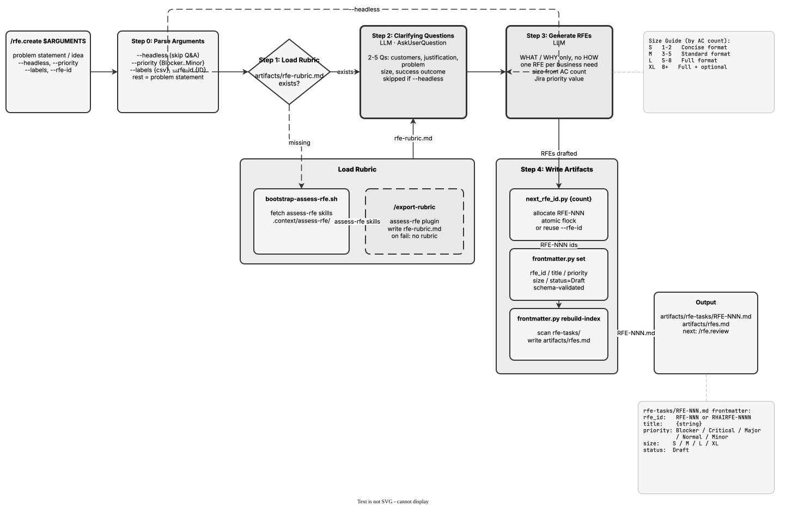

<!-- Auto-generated from registry.yaml. Do not edit directly. -->


# rfe.create

Generate new RFEs from a problem statement, idea, or need. Loads the
assess-rfe rubric (bootstrapping it if needed), and unless run headless
asks 2-5 clarifying questions about affected customers, business
justification, the user's problem, size, and success criteria. Produces
well-formed RFEs from a template that describe WHAT and WHY (business
needs), never HOW (implementation) -- it explicitly avoids loading
architecture context so it won't prescribe a solution. Determines each
RFE's t-shirt size from its acceptance-criteria count via the Size Guide
(S: 1-2, M: 3-5, L: 5-8, XL: 8+), allocates IDs atomically (or uses a
pre-assigned `--rfe-id`), writes artifacts with YAML frontmatter via
scripts/frontmatter.py, and rebuilds the index.

**Plugin**: [rfe-creator](index.md) | **:material-check: User-invocable**

## Diagram

<div class="diagram-container" markdown>

</div>

## Arguments

```bash
/rfe.create <problem-statement> [--headless] [--priority <value>] [--labels <csv>] [--rfe-id <ID>]
```

| Argument | Required | Default | Description |
|----------|----------|---------|-------------|
| `problem-statement` | :material-check: | - | The problem statement, idea, or need to turn into RFEs |
| `--headless` |  | - | Skip clarifying questions (Step 2), generate RFEs directly from the input |
| `--priority` |  | `Normal` | Override default priority for created RFEs |
| `--labels` |  | - | Labels to apply to created RFEs |
| `--rfe-id` |  | - | Pre-assigned RFE ID; use this instead of allocating a new one. The placeholder file must already exist. |

## Usage

```bash
/rfe.create Users need better error messages when model serving fails
/rfe.create --headless --priority Critical Fix dashboard latency for large clusters
/rfe.create --headless --rfe-id RFE-003 --labels candidate-3.5 Support GPU sharing
```
