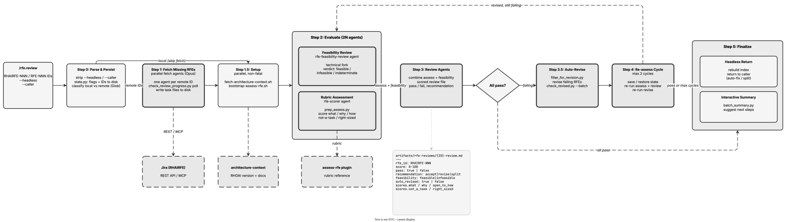

<!-- Auto-generated from registry.yaml. Do not edit directly. -->


# rfe.review

Score and improve RFEs with a multi-phase agent pipeline. Accepts one or
more Jira keys (RHAIRFE-NNNN) or local IDs (RFE-NNN); missing RFEs are
fetched from Jira first. The orchestrator never reads RFE content directly
-- all content-heavy work is delegated to background sub-agents (fetch,
assess, feasibility, review, revise) launched in parallel waves and polled
via scripts/check_review_progress.py. It runs rubric-based assessment
(assess-rfe / rfe-scorer subagent), launches per-RFE feasibility checks
(rfe-feasibility-review), synthesizes scored review files, auto-revises
failing RFEs (filter_for_revision.py), and re-assesses up to 2 cycles,
preserving cumulative scores and revision history across cycles. Can return
headlessly to a calling skill (auto-fix or split) or print an interactive
summary with next-step suggestions.

**Plugin**: [rfe-creator](index.md) | **:material-check: User-invocable**

## Contract

<div class="skill-contract">
  <header class="skill-contract__header">
    <span class="skill-contract__eyebrow">Skill Contract</span>
    <span class="skill-contract__version">canonical-skill-v1</span>
  </header>
  <p class="skill-contract__lede">Score RFEs against the rubric, check technical feasibility, and auto-revise failing RFEs across up to two re-assessment cycles.</p>
  <section class="skill-contract__section" data-section="01">
    <h3 class="skill-contract__section-title"><span class="skill-contract__section-name">Identity</span></h3>
    <div class="skill-contract__row">
      <span class="skill-contract__field">Functions</span>
      <div class="skill-contract__inline">
        <span class="skill-contract__chip skill-contract__chip--function">review</span>
      </div>
    </div>
    <div class="skill-contract__row">
      <span class="skill-contract__field">Success</span>
      <ul class="skill-contract__list">
        <li>Produces a review file with rubric scores, a feasibility verdict, and a recommendation per RFE.</li>
        <li>Auto-revises failing RFEs and re-assesses up to 2 cycles.</li>
      </ul>
    </div>
  </section>
  <section class="skill-contract__section" data-section="02">
    <h3 class="skill-contract__section-title"><span class="skill-contract__section-name">Optimization Targets</span></h3>
    <div class="skill-contract__metrics">
      <div class="skill-contract__metric">
        <code class="skill-contract__metric-id">task_success</code>
        <span class="skill-contract__measure skill-contract__measure--judge">judge</span>
        <a class="skill-contract__ref" href="https://github.com/opendatahub-io/rfe-creator/blob/c8a2a1edb53654f08bbe67b7aa4382121e22866f/.claude/skills/rfe.review/SKILL.md" title="opendatahub-io/rfe-creator@c8a2a1edb53654f08bbe67b7aa4382121e22866f:.claude/skills/rfe.review/SKILL.md">SKILL.md @ c8a2a1e<span class="skill-contract__ref-arrow" aria-hidden="true">&#x2192;</span></a>
      </div>
      <div class="skill-contract__metric">
        <code class="skill-contract__metric-id">output_quality</code>
        <span class="skill-contract__measure skill-contract__measure--judge">judge</span>
        <a class="skill-contract__ref" href="https://github.com/opendatahub-io/rfe-creator/blob/c8a2a1edb53654f08bbe67b7aa4382121e22866f/.claude/skills/rfe.review/SKILL.md" title="opendatahub-io/rfe-creator@c8a2a1edb53654f08bbe67b7aa4382121e22866f:.claude/skills/rfe.review/SKILL.md">SKILL.md @ c8a2a1e<span class="skill-contract__ref-arrow" aria-hidden="true">&#x2192;</span></a>
      </div>
    </div>
  </section>
  <section class="skill-contract__section" data-section="03">
    <h3 class="skill-contract__section-title"><span class="skill-contract__section-name">Invariants</span></h3>
    <div class="skill-contract__row">
      <span class="skill-contract__field">Must Preserve</span>
      <ul class="skill-contract__list">
        <li>Never read RFE bodies into orchestrator context — delegate to agents and read only frontmatter.</li>
        <li>Do not exceed 2 re-assessment cycles.</li>
      </ul>
    </div>
    <div class="skill-contract__row">
      <span class="skill-contract__field">Fixed Context</span>
      <div class="skill-contract__code">
      <div class="skill-contract__code-line"><span class="skill-contract__code-key">tools</span><span class="skill-contract__code-val">Glob, Bash, Agent, AskUserQuestion</span></div>
      <div class="skill-contract__code-line"><span class="skill-contract__code-key">cli</span><span class="skill-contract__code-val">python3</span></div>
      <div class="skill-contract__code-line"><span class="skill-contract__code-key">knowledge</span><span class="skill-contract__code-val">repository_content<span class="skill-contract__privacy">public</span>, task_input<span class="skill-contract__privacy">task_private</span>, tool_output<span class="skill-contract__privacy">task_private</span></span></div>
      </div>
    </div>
  </section>
  <section class="skill-contract__section" data-section="04">
    <h3 class="skill-contract__section-title"><span class="skill-contract__section-name">Traceability</span></h3>
    <div class="skill-contract__row">
      <span class="skill-contract__field">Skill</span>
      <div class="skill-contract__inline"><a class="skill-contract__path" href="https://github.com/opendatahub-io/rfe-creator/blob/c8a2a1edb53654f08bbe67b7aa4382121e22866f/.claude/skills/rfe.review/SKILL.md"><span class="skill-contract__ref-arrow" aria-hidden="true">&#x2197;</span><code>.claude/skills/rfe.review/SKILL.md</code></a></div>
    </div>
    <div class="skill-contract__row">
      <span class="skill-contract__field">Supporting</span>
      <ul class="skill-contract__paths">
        <li><a class="skill-contract__path" href="https://github.com/opendatahub-io/rfe-creator/blob/c8a2a1edb53654f08bbe67b7aa4382121e22866f/.claude/skills/rfe.review/prompts/fetch-agent.md"><span class="skill-contract__ref-arrow" aria-hidden="true">&#x2197;</span><code>.claude/skills/rfe.review/prompts/fetch-agent.md</code></a></li>
        <li><a class="skill-contract__path" href="https://github.com/opendatahub-io/rfe-creator/blob/c8a2a1edb53654f08bbe67b7aa4382121e22866f/.claude/skills/rfe.review/prompts/assess-agent.md"><span class="skill-contract__ref-arrow" aria-hidden="true">&#x2197;</span><code>.claude/skills/rfe.review/prompts/assess-agent.md</code></a></li>
        <li><a class="skill-contract__path" href="https://github.com/opendatahub-io/rfe-creator/blob/c8a2a1edb53654f08bbe67b7aa4382121e22866f/.claude/skills/rfe.review/prompts/review-agent.md"><span class="skill-contract__ref-arrow" aria-hidden="true">&#x2197;</span><code>.claude/skills/rfe.review/prompts/review-agent.md</code></a></li>
        <li><a class="skill-contract__path" href="https://github.com/opendatahub-io/rfe-creator/blob/c8a2a1edb53654f08bbe67b7aa4382121e22866f/.claude/skills/rfe.review/prompts/revise-agent.md"><span class="skill-contract__ref-arrow" aria-hidden="true">&#x2197;</span><code>.claude/skills/rfe.review/prompts/revise-agent.md</code></a></li>
      </ul>
    </div>
  </section>
</div>

## Diagram

<div class="diagram-container" markdown>

</div>

## Arguments

```bash
/rfe.review <ID> [ID2 ...] [--headless] [--caller <name>]
```

| Argument | Required | Default | Description |
|----------|----------|---------|-------------|
| `ID` | :material-check: | - | One or more space-separated RFE IDs (RHAIRFE-NNNN or RFE-NNN) |
| `--headless` |  | - | Suppress end-of-run summary; used when called from rfe.auto-fix or rfe.split |
| `--caller` |  | `none` | Identifies calling skill for headless return routing |

## Usage

```bash
/rfe.review RHAIRFE-1234
/rfe.review RFE-001 RFE-002 RFE-003
/rfe.review --headless --caller autofix RHAIRFE-1234 RHAIRFE-5678
```
