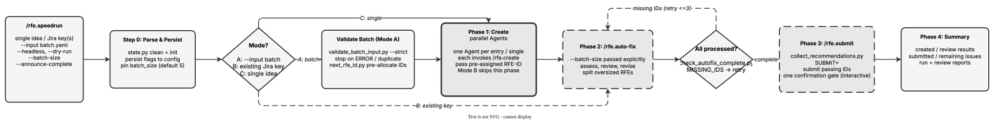

<!-- Auto-generated from registry.yaml. Do not edit directly. -->


# rfe.speedrun

Execute the full RFE pipeline end-to-end -- create, auto-fix (review +
revise + split), and submit -- with minimal interaction. Detects one of
three modes: batch YAML input (multiple ideas in a file), one or more
existing Jira keys, or a single free-text idea. In batch mode it validates
the input file with validate_batch_input.py --strict before spending any
agent budget, pre-allocates all RFE IDs, and launches one parallel
rfe.create agent per entry. It always passes an explicit --batch-size to
auto-fix for reproducibility, then verifies completeness with
check_autofix_complete.py and re-invokes auto-fix on any missing IDs (up to
3 retries). Orchestrates purely by invoking rfe.create, rfe.auto-fix, and
rfe.submit, persisting config and IDs to disk between phases to survive
context compression.

**Plugin**: [rfe-creator](index.md) | **:material-check: User-invocable**

## Contract

<div class="skill-contract">
  <header class="skill-contract__header">
    <span class="skill-contract__eyebrow">Skill Contract</span>
    <span class="skill-contract__version">canonical-skill-v1</span>
  </header>
  <p class="skill-contract__lede">Run the full RFE pipeline end-to-end — create, auto-fix, and submit — from an idea, Jira key(s), or a batch file.</p>
  <section class="skill-contract__section" data-section="01">
    <h3 class="skill-contract__section-title"><span class="skill-contract__section-name">Identity</span></h3>
    <div class="skill-contract__row">
      <span class="skill-contract__field">Functions</span>
      <div class="skill-contract__inline">
        <span class="skill-contract__chip skill-contract__chip--function">orchestrate</span>
      </div>
    </div>
    <div class="skill-contract__row">
      <span class="skill-contract__field">Success</span>
      <ul class="skill-contract__list">
        <li>Runs create, auto-fix, and submit in sequence, persisting IDs and config between phases.</li>
        <li>Verifies completeness and retries missing IDs before submitting.</li>
      </ul>
    </div>
  </section>
  <section class="skill-contract__section" data-section="02">
    <h3 class="skill-contract__section-title"><span class="skill-contract__section-name">Optimization Targets</span></h3>
    <div class="skill-contract__metrics">
      <div class="skill-contract__metric">
        <code class="skill-contract__metric-id">task_success</code>
        <span class="skill-contract__measure skill-contract__measure--judge">judge</span>
        <a class="skill-contract__ref" href="https://github.com/opendatahub-io/rfe-creator/blob/c8a2a1edb53654f08bbe67b7aa4382121e22866f/.claude/skills/rfe.speedrun/SKILL.md" title="opendatahub-io/rfe-creator@c8a2a1edb53654f08bbe67b7aa4382121e22866f:.claude/skills/rfe.speedrun/SKILL.md">SKILL.md @ c8a2a1e<span class="skill-contract__ref-arrow" aria-hidden="true">&#x2192;</span></a>
      </div>
    </div>
  </section>
  <section class="skill-contract__section" data-section="03">
    <h3 class="skill-contract__section-title"><span class="skill-contract__section-name">Invariants</span></h3>
    <div class="skill-contract__row">
      <span class="skill-contract__field">Must Preserve</span>
      <ul class="skill-contract__list">
        <li>Always pass an explicit batch size to auto-fix for reproducibility.</li>
        <li>Never emit a text-only response during pipeline execution, which terminates the CI process.</li>
      </ul>
    </div>
    <div class="skill-contract__row">
      <span class="skill-contract__field">Fixed Context</span>
      <div class="skill-contract__code">
      <div class="skill-contract__code-line"><span class="skill-contract__code-key">tools</span><span class="skill-contract__code-val">Read, Write, Edit, Glob, Grep, Bash, AskUserQuestion, Skill</span></div>
      <div class="skill-contract__code-line"><span class="skill-contract__code-key">cli</span><span class="skill-contract__code-val">python3</span></div>
      <div class="skill-contract__code-line"><span class="skill-contract__code-key">knowledge</span><span class="skill-contract__code-val">repository_content<span class="skill-contract__privacy">public</span>, task_input<span class="skill-contract__privacy">task_private</span>, tool_output<span class="skill-contract__privacy">task_private</span></span></div>
      </div>
    </div>
  </section>
  <section class="skill-contract__section" data-section="04">
    <h3 class="skill-contract__section-title"><span class="skill-contract__section-name">Traceability</span></h3>
    <div class="skill-contract__row">
      <span class="skill-contract__field">Skill</span>
      <div class="skill-contract__inline"><a class="skill-contract__path" href="https://github.com/opendatahub-io/rfe-creator/blob/c8a2a1edb53654f08bbe67b7aa4382121e22866f/.claude/skills/rfe.speedrun/SKILL.md"><span class="skill-contract__ref-arrow" aria-hidden="true">&#x2197;</span><code>.claude/skills/rfe.speedrun/SKILL.md</code></a></div>
    </div>
  </section>
</div>

## Diagram

<div class="diagram-container" markdown>

</div>

## Arguments

```bash
/rfe.speedrun <idea-or-key> [--input <path>] [--headless] [--dry-run] [--batch-size N] [--announce-complete]
```

| Argument | Required | Default | Description |
|----------|----------|---------|-------------|
| `idea-or-key` |  | - | A free-text idea or Jira key (RHAIRFE-NNNN). Mutually exclusive with --input. |
| `--input` |  | - | Path to a YAML file with batch entries (prompt, priority, labels per entry) |
| `--headless` |  | - | Suppress questions and confirmations (for CI/eval) |
| `--dry-run` |  | - | Skip Jira writes in submit phase |
| `--batch-size` |  | `5` | Override batch size for auto-fix phase (always passed through explicitly) |
| `--announce-complete` |  | - | Print completion marker when done (for CI/eval harnesses) |

## Usage

```bash
/rfe.speedrun Better dashboard for ML model monitoring
/rfe.speedrun RHAIRFE-1234
/rfe.speedrun --input batch.yaml --headless --dry-run
/rfe.speedrun --input batch.yaml --headless --batch-size 10 --announce-complete
```
