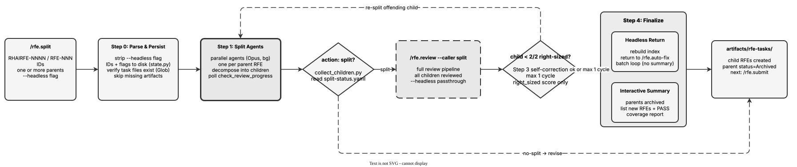

<!-- Auto-generated from registry.yaml. Do not edit directly. -->


# rfe.split

Decompose oversized RFEs into appropriately-scoped pieces. Runs
non-interactively: launches parallel split agents that analyze each parent
RFE and generate child RFEs, collects the children (collect_children.py),
then invokes rfe.review on all of them via an inline Skill call. Includes a
right-sizing self-correction loop (1 cycle max) that re-splits any child
still scoring below 2/2 on right-sizing, validates that all original scope
is covered, and archives the parent RFE. Parents assessed as "no-split"
have their recommendation downgraded to `revise` so downstream consumers
don't treat them as pending splits.

**Plugin**: [rfe-creator](index.md) | **:material-check: User-invocable**

## Diagram

<div class="diagram-container" markdown>

</div>

## Arguments

```bash
/rfe.split <ID> [ID2 ...] [--headless]
```

| Argument | Required | Default | Description |
|----------|----------|---------|-------------|
| `ID` | :material-check: | - | One or more space-separated RFE IDs (RHAIRFE-NNNN or RFE-NNN) to split |
| `--headless` |  | - | Suppress end-of-run summary; used when called from rfe.auto-fix |

## Usage

```bash
/rfe.split RHAIRFE-1234
/rfe.split RHAIRFE-1234 RHAIRFE-5678
```
