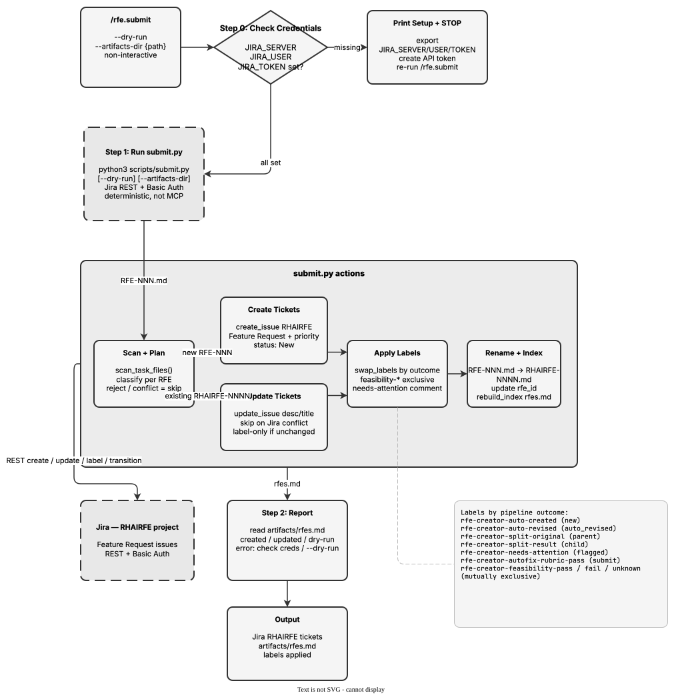

<!-- Auto-generated from registry.yaml. Do not edit directly. -->


# rfe.submit

Push RFEs to Jira via deterministic Python scripts (scripts/submit.py)
using the REST API with Basic Auth. Creates new RHAIRFE tickets for new
RFEs or updates existing tickets for fetched RFEs, then rebuilds
artifacts/rfes.md and reports results. Applies labels automatically based
on pipeline outcomes (auto-created, auto-revised, split-original,
split-result, needs-attention, rubric-pass, and the three mutually
exclusive feasibility verdicts). Non-interactive by design -- invoking the
skill is the confirmation, no dry-run approval step. Requires JIRA_SERVER,
JIRA_USER, and JIRA_TOKEN environment variables.

**Plugin**: [rfe-creator](index.md) | **:material-check: User-invocable**

## Diagram

<div class="diagram-container" markdown>

</div>

## Arguments

```bash
/rfe.submit [--dry-run] [--artifacts-dir <path>]
```

| Argument | Required | Default | Description |
|----------|----------|---------|-------------|
| `--dry-run` |  | - | Validate locally without writing to Jira |
| `--artifacts-dir` |  | `artifacts` | Path to the artifacts directory |

## Usage

```bash
/rfe.submit
/rfe.submit --dry-run
```
