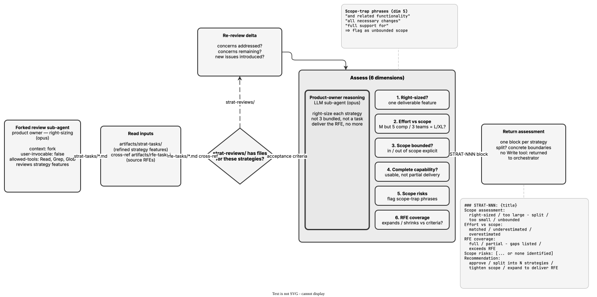

<!-- Auto-generated from registry.yaml. Do not edit directly. -->


# scope-review

Internal forked reviewer sub-agent (context: fork, model: opus) for the
strategy workflow. Acts as a product owner assessing whether each refined
strategy in artifacts/strat-tasks/ is right-sized -- not so big it needs
splitting, not so small it's just a task -- and scoped to match its effort
estimate. Checks that scope is explicitly bounded, that the strategy
delivers a complete capability, and that it neither silently expands nor
shrinks the source RFE. Flags scope-trap phrasing ("and related
functionality", "full support for"), and when recommending a split suggests
concrete boundaries for each resulting strategy.

**Plugin**: [rfe-creator](index.md) | **:material-check: User-invocable**

## Diagram

<div class="diagram-container" markdown>

</div>

## Usage

```bash
/scope-review
```
