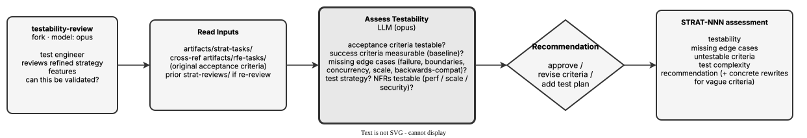

<!-- Auto-generated from registry.yaml. Do not edit directly. -->


# testability-review

Internal forked reviewer sub-agent (context: fork, model: opus) for the
strategy workflow. Acts as a test engineer determining whether each refined
strategy in artifacts/strat-tasks/ can be validated: are acceptance criteria
testable and success criteria measurable (with a baseline), what edge cases
are missing (failure modes, boundary conditions, concurrent access,
large-scale, backwards compatibility), what test strategy is needed, and can
the non-functional requirements (performance, scalability, security) be
tested. Suggests concrete rewrites for vague criteria and emits an approve /
revise-criteria / add-test-plan recommendation.

**Plugin**: [rfe-creator](index.md) | **:material-check: User-invocable**

## Diagram

<div class="diagram-container" markdown>

</div>

## Usage

```bash
/testability-review
```
