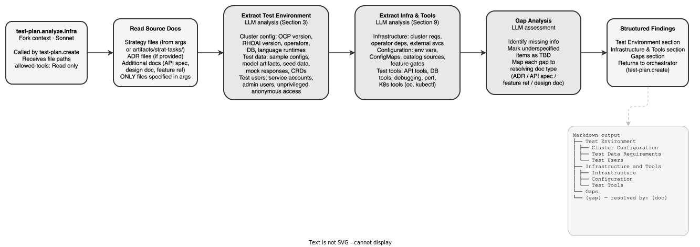

<!-- Auto-generated from registry.yaml. Do not edit directly. -->

# test-plan.analyze.infra

Identify environment and infrastructure needs

**Plugin**: [test-plan](index.md) | **:material-close: Internal**

## Diagram

