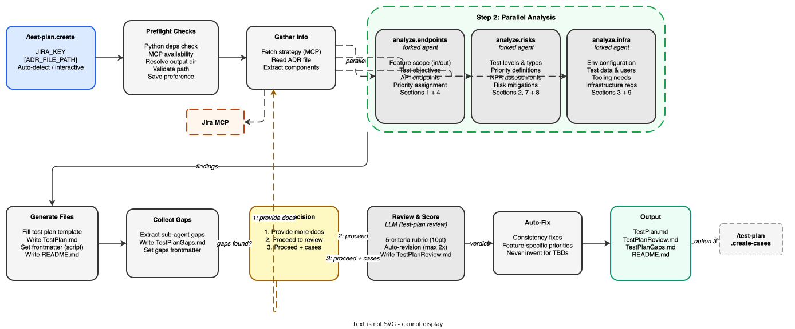

<!-- Auto-generated from registry.yaml. Do not edit directly. -->


# test-plan.create

Generate a complete test plan for a RHOAI feature from a strategy document.
Spawns 3 parallel sub-analyzers (endpoints, risks, infra), merges findings,
and runs an automated review with scoring and auto-revision.

**Plugin**: [test-plan](index.md) | **:material-check: User-invocable**

## Diagram

<div class="diagram-container" markdown>

</div>

## Arguments

| Argument | Required | Default | Description |
|----------|----------|---------|-------------|
| `JIRA_KEY` | :material-check: | — | Strategy key (RHAISTRAT-*) or issue key (RHOAIENG-*) |
| `ADR_FILE_PATH` |  | — | Local path to ADR document (markdown, text, or PDF) |
| `--output-dir` |  | — | Override output directory for test plan artifacts |

## Usage

```
/test-plan.create RHAISTRAT-400
/test-plan.create RHOAIENG-48676
/test-plan.create RHAISTRAT-400 /path/to/adr.pdf
```
